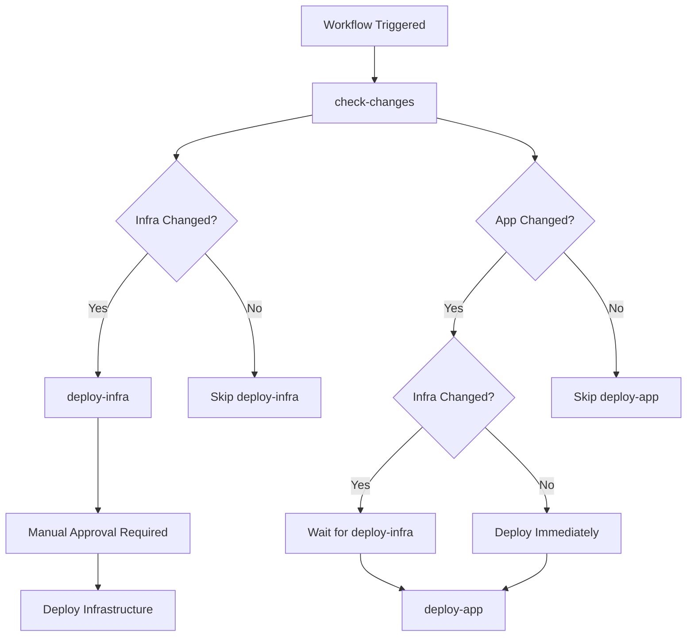

# Production Deployment Workflow Setup Guide

This guide explains how to configure the Production Deployment workflow for automated deployment of both Azure Infrastructure (Bicep) and the React Frontend (Static Web App).

## Overview

The Production Deployment workflow (`deploy-production.yml`) automates:
- **Infrastructure deployment** (Bicep templates) with manual approval
- **Application deployment** (Static Web App + Function App) with automatic approval
- **Conditional logic** to skip infrastructure deployment if no infra/scripts changes

## Differences from Infrastructure Check Workflow

| Aspect | Infrastructure Check | Production Deployment |
|--------|---------------------|----------------------|
| **Purpose** | Validate changes (read-only) | Deploy changes (write access) |
| **Authentication** | OIDC with read permissions | OIDC with write permissions |
| **Approval** | None (automatic) | Infrastructure: Manual, App: Automatic |
| **Secrets** | `AZURE_DEPLOYER_CLIENT_ID` | Same secrets, different federated credentials |
| **Triggers** | Pull requests | Push to main, workflow_dispatch |
| **Environments** | None | `Infra-Prod` (manual), `SWA-Prod` (tracking) |

## Prerequisites

- Azure subscription with appropriate permissions
- Contributor or Owner role on the target resource group (`Glooko`)
- Permission to create App Registrations in Azure AD
- Admin access to GitHub repository settings
- Existing infrastructure deployed or ready to deploy

## Step 1: Create Azure AD Application (if not exists)

If you already created an App Registration for the Infrastructure Check workflow, you can **reuse the same application** but add additional federated credentials for deployment.

### Option A: Reuse Existing App Registration

```bash
# Get existing app ID
APP_NAME="GlookoDataWebApp-GitHub-Actions"
APP_ID=$(az ad app list --display-name "$APP_NAME" --query "[0].appId" -o tsv)
TENANT_ID=$(az account show --query tenantId -o tsv)
SUBSCRIPTION_ID=$(az account show --query id -o tsv)

echo "Reusing existing App Registration:"
echo "Application (Client) ID: $APP_ID"
echo "Tenant ID: $TENANT_ID"
echo "Subscription ID: $SUBSCRIPTION_ID"
```

### Option B: Create New App Registration

```bash
# Set variables
APP_NAME="GlookoDataWebApp-GitHub-Actions-Deploy"
SUBSCRIPTION_ID=$(az account show --query id -o tsv)
RESOURCE_GROUP="Glooko"

# Create the app registration
az ad app create --display-name "$APP_NAME"

# Get the Application (Client) ID
APP_ID=$(az ad app list --display-name "$APP_NAME" --query "[0].appId" -o tsv)
echo "Application (Client) ID: $APP_ID"

# Get the Tenant ID
TENANT_ID=$(az account show --query tenantId -o tsv)
echo "Tenant ID: $TENANT_ID"
```

## Step 2: Create Service Principal and Assign Permissions

The service principal needs **Contributor** role to deploy resources:

```bash
# Create service principal (skip if already exists)
az ad sp create --id $APP_ID

# Get the Service Principal Object ID
SP_OBJECT_ID=$(az ad sp list --display-name "$APP_NAME" --query "[0].id" -o tsv)
echo "Service Principal Object ID: $SP_OBJECT_ID"

# Assign Contributor role to the resource group
az role assignment create \
  --role "Contributor" \
  --assignee $APP_ID \
  --scope "/subscriptions/$SUBSCRIPTION_ID/resourceGroups/$RESOURCE_GROUP"

echo "✅ Service Principal created and assigned Contributor role"
```

**Note:** Contributor role is required for deploying infrastructure. The Infrastructure Check workflow only needs read permissions for what-if analysis, but this deployment workflow needs write permissions.

## Step 3: Configure OIDC Federated Credentials for Deployment

Add federated credentials that allow GitHub Actions to deploy from the `main` branch:

```bash
# Get your GitHub repository details
GITHUB_ORG="iricigor"              # Your GitHub username or organization
GITHUB_REPO="GlookoDataWebApp"     # Your repository name

# Create federated credential for main branch (push events)
az ad app federated-credential create \
  --id $APP_ID \
  --parameters '{
    "name": "GitHubActionsDeployMain",
    "issuer": "https://token.actions.githubusercontent.com",
    "subject": "repo:'"$GITHUB_ORG/$GITHUB_REPO"':ref:refs/heads/main",
    "description": "GitHub Actions - Production deployment from main branch",
    "audiences": ["api://AzureADTokenExchange"]
  }'

# Create federated credential for workflow_dispatch
az ad app federated-credential create \
  --id $APP_ID \
  --parameters '{
    "name": "GitHubActionsDeployDispatch",
    "issuer": "https://token.actions.githubusercontent.com",
    "subject": "repo:'"$GITHUB_ORG/$GITHUB_REPO"':ref:refs/heads/main",
    "description": "GitHub Actions - Manual deployment workflow",
    "audiences": ["api://AzureADTokenExchange"]
  }'

echo "✅ OIDC federated credentials configured for deployment"
```

**Important:** These federated credentials are different from the PR credentials used in the Infrastructure Check workflow. They allow authentication when running workflows from the `main` branch, not from pull requests.

### Verify Federated Credentials

```bash
# List all federated credentials for the app
az ad app federated-credential list --id $APP_ID --output table

# You should see credentials for:
# - Pull requests (Infrastructure Check workflow)
# - Main branch pushes (Deployment workflow)
# - Workflow dispatch (Manual deployments)
```

## Step 4: Configure GitHub Secrets

The deployment workflow uses the **same secrets** as the Infrastructure Check workflow. If you've already set them up, you can skip this step.

Add the following secrets to your GitHub repository:

1. Go to your repository on GitHub
2. Navigate to **Settings** → **Secrets and variables** → **Actions**
3. Click **New repository secret** and add each of the following:

| Secret Name | Value | How to Get |
|-------------|-------|------------|
| `AZURE_DEPLOYER_CLIENT_ID` | Application (Client) ID | `echo $APP_ID` or from Azure Portal |
| `AZURE_TENANT_ID` | Azure AD Tenant ID | `echo $TENANT_ID` or from Azure Portal |
| `AZURE_SUBSCRIPTION_ID` | Azure Subscription ID | `echo $SUBSCRIPTION_ID` or `az account show --query id -o tsv` |
| `AZURE_STATIC_WEB_APPS_API_TOKEN_WONDERFUL_STONE_071384103` | SWA deployment token | Azure Portal → Static Web App → Manage deployment token |
| `AZURE_FUNCTIONAPP_PUBLISH_PROFILE` | Function App publish profile | Azure Portal → Function App → Get publish profile |
| `VITE_GOOGLE_CLIENT_ID` | Google OAuth Client ID | Google Cloud Console |

**Note:** The first three secrets (`AZURE_DEPLOYER_CLIENT_ID`, `AZURE_TENANT_ID`, `AZURE_SUBSCRIPTION_ID`) are the same ones used by the Infrastructure Check workflow.

## Step 5: Configure GitHub Environments

The deployment workflow uses two environments for approval control:

### Environment 1: Infra-Prod (Manual Approval Required)

This environment protects infrastructure deployments and requires manual approval before deploying.

1. Go to **Settings** → **Environments** → **New environment**
2. Name: `Infra-Prod`
3. Configure protection rules:
   - ✅ **Required reviewers**: Add yourself or team members who should approve infrastructure changes
   - ✅ **Wait timer**: Optional (e.g., 0 minutes for immediate approval after review)
   - ✅ **Deployment branches**: Limit to `main` branch only
4. Click **Save protection rules**

### Environment 2: SWA-Prod (Auto-Approved/Tracking Only)

This environment tracks application deployments but doesn't require approval.

1. Go to **Settings** → **Environments** → **New environment**
2. Name: `SWA-Prod`
3. Configure protection rules (optional):
   - ✅ **Deployment branches**: Limit to `main` branch only
   - ❌ **Required reviewers**: Leave empty for automatic approval
4. Click **Save protection rules**

## Step 6: Test the Workflow

### Option 1: Manual Test (workflow_dispatch)

1. Go to **Actions** tab in your GitHub repository
2. Select **Deploy to Production** workflow
3. Click **Run workflow**
4. Choose options:
   - **Deploy infrastructure**: ✅ (to test infrastructure deployment)
   - **Deploy application**: ✅ (to test application deployment)
5. Click **Run workflow**
6. The workflow will wait for manual approval on the `Infra-Prod` environment
7. Approve the deployment in the **Environments** section

### Option 2: Push to Main Branch

1. Make a change to an infrastructure file (e.g., `infra/main.bicep`)
2. Commit and push to `main` branch
3. The workflow will automatically trigger
4. The `deploy-infra` job will wait for manual approval
5. The `deploy-app` job will wait for `deploy-infra` to complete

### Option 3: Test Application Deployment Only

1. Make a change to application code (e.g., `src/App.tsx`)
2. Commit and push to `main` branch
3. The workflow will automatically trigger
4. The `deploy-infra` job will be **skipped** (no infrastructure changes)
5. The `deploy-app` job will proceed **immediately** without waiting

## How the Workflow Works

### Conditional Logic - Path-Based Filtering

The workflow intelligently determines what to deploy by analyzing file changes in the push:

**For automatic deployments (push to main):**
- Compares **all files changed** between the commit before the push (`github.event.before`) and the latest commit (`github.event.after`)
- This captures changes across **multiple commits** in a single push
- **Infrastructure changes** detected in: `infra/**`, `scripts/**`
- **Application changes** detected in: `src/**`, `api/**`, `public/**`, `package.json`, `package-lock.json`, `vite.config.ts`, `staticwebapp.config.json`

**For manual deployments (workflow_dispatch):**
- Uses the manual input checkboxes to control what gets deployed
- Allows deploying infrastructure, application, or both

**Examples:**

1. **Single commit with infra change:**
   - Commit: Changes `infra/main.bicep`
   - Push to main
   - Result: Infrastructure deployment triggered ✅

2. **Multiple commits with mixed changes:**
   - Commit 1: Changes `infra/main.bicep`
   - Commit 2: Changes `src/App.tsx`
   - Commit 3: Changes `README.md`
   - Push all to main
   - Result: Both infrastructure AND application deployments triggered ✅

3. **Application-only change:**
   - Commit: Changes `src/components/Dashboard.tsx`
   - Push to main
   - Result: Only application deployment triggered, infrastructure skipped ⏭️

4. **Documentation-only change:**
   - Commit: Changes `docs/DEPLOYMENT.md`
   - Push to main
   - Result: Both deployments skipped (no relevant files changed) ⏭️

### Execution Flow



### Job Dependencies

- `deploy-infra` depends on `check-changes`
- `deploy-app` depends on both `check-changes` and `deploy-infra`
- `deploy-app` uses `always()` to run even if `deploy-infra` is skipped
- `deploy-app` only runs if:
  - App changed AND
  - (Infra didn't change OR infra deployment succeeded)

## Troubleshooting

### Error: "No subscription found"

**Cause:** The service principal doesn't have the Contributor role.

**Solution:** Assign the Contributor role:

```bash
az role assignment create \
  --role "Contributor" \
  --assignee $APP_ID \
  --scope "/subscriptions/$SUBSCRIPTION_ID/resourceGroups/$RESOURCE_GROUP"
```

### Error: "AADSTS700016: Application not found"

**Cause:** The federated credential is not configured correctly.

**Solution:** Verify the credential:

```bash
az ad app federated-credential list --id $APP_ID
```

Ensure the `subject` field matches: `repo:OWNER/REPO:ref:refs/heads/main`

### Infrastructure Job Stuck Waiting for Approval

**Cause:** The `Infra-Prod` environment requires manual approval.

**Solution:** This is expected behavior. To approve:

1. Go to **Actions** → Select the workflow run
2. Click **Review deployments**
3. Select `Infra-Prod`
4. Click **Approve and deploy**

### Application Job Skipped Even Though App Changed

**Cause:** The `deploy-infra` job failed, so `deploy-app` was skipped.

**Solution:** Fix the infrastructure deployment issue first, then retry.

### Both Jobs Skipped

**Cause:** No relevant files were changed.

**Solution:** This is expected. The workflow only runs when infrastructure or application files are modified.

## Security Best Practices

✅ **Do's:**
- Use OIDC authentication (no long-lived credentials)
- Require manual approval for infrastructure changes
- Grant minimum required permissions (Contributor on resource group only)
- Regularly review and rotate credentials
- Monitor workflow runs for suspicious activity
- Use separate environments for infra and app deployments

❌ **Don'ts:**
- Never store Azure credentials (passwords, keys) as GitHub secrets
- Don't grant Owner role unless absolutely necessary
- Don't disable environment protection for infrastructure deployments
- Don't use service principal authentication keys (use OIDC instead)
- Don't allow infrastructure deployments from feature branches

## Workflow Behavior Examples

### Example 1: Infrastructure Change Only

**Files Changed:** `infra/main.bicep`

**Workflow Behavior:**
1. ✅ `check-changes`: infra=true, app=false
2. ✅ `deploy-infra`: Waits for manual approval, then deploys infrastructure
3. ⏭️ `deploy-app`: Skipped (no app changes)

### Example 2: Application Change Only

**Files Changed:** `src/App.tsx`

**Workflow Behavior:**
1. ✅ `check-changes`: infra=false, app=true
2. ⏭️ `deploy-infra`: Skipped (no infra changes)
3. ✅ `deploy-app`: Deploys immediately (no waiting for deploy-infra)

### Example 3: Both Infrastructure and Application Changes

**Files Changed:** `infra/main.bicep`, `src/App.tsx`

**Workflow Behavior:**
1. ✅ `check-changes`: infra=true, app=true
2. ✅ `deploy-infra`: Waits for manual approval, then deploys infrastructure
3. ✅ `deploy-app`: Waits for deploy-infra to complete, then deploys application

### Example 4: Documentation Change Only

**Files Changed:** `README.md`

**Workflow Behavior:**
1. ✅ `check-changes`: infra=false, app=false
2. ⏭️ `deploy-infra`: Skipped
3. ⏭️ `deploy-app`: Skipped

## Next Steps

After setting up this workflow:

1. ✅ Test the workflow with a manual run (workflow_dispatch)
2. ✅ Verify environment protections work correctly
3. ✅ Test conditional logic by making different types of changes
4. ✅ Document your team's approval process for infrastructure changes
5. 🚀 Set up notifications for deployment approvals

## Resources

- [Azure OIDC with GitHub Actions](https://learn.microsoft.com/azure/developer/github/connect-from-azure)
- [GitHub Actions Environments](https://docs.github.com/en/actions/deployment/targeting-different-environments/using-environments-for-deployment)
- [GitHub Actions OIDC](https://docs.github.com/en/actions/deployment/security-hardening-your-deployments/configuring-openid-connect-in-azure)
- [Infrastructure Check Setup](./INFRA_CHECK_SETUP.md) - For read-only what-if analysis
- [Infrastructure Documentation](../../infra/README.md)

## Support

For issues or questions:

- Open an issue on [GitHub](https://github.com/iricigor/GlookoDataWebApp/issues)
- Review the [Infrastructure Check Setup](./INFRA_CHECK_SETUP.md) guide
- Check the main [Deployment Guide](../../docs/DEPLOYMENT.md)
