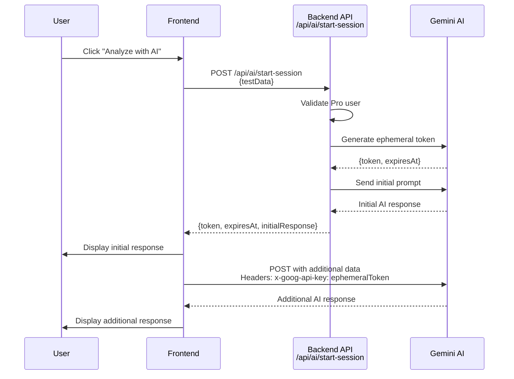

# AI Session Implementation

## Overview
The `startAISession` endpoint enables Pro users to interact with Gemini AI while keeping the master API key secure on the backend. Frontend sends additional data directly to Gemini using ephemeral tokens.

## Flow Diagram



## Architecture

### Backend (`POST /api/ai/start-session`)
1. Validates Pro user status
2. Retrieves Gemini API key from Key Vault
3. Generates ephemeral Gemini token (30min expiry, single-use)
4. Sends initial prompt to Gemini API
5. Returns: `{ token, expiresAt, initialResponse }`

### Frontend
1. Calls `/api/ai/start-session`
2. Displays initial AI response
3. Uses ephemeral token to call Gemini API directly:
   ```typescript
   fetch('https://generativelanguage.googleapis.com/v1beta/models/gemini-2.0-flash-exp:generateContent', {
     headers: { 'x-goog-api-key': ephemeralToken }
   })
   ```
4. Displays additional AI response

**Key Point**: Additional user data goes directly to Gemini (never touches our backend)

## API Reference

**Endpoint**: `POST /api/ai/start-session`  
**Authentication**: Pro users only

**Request**:
```json
{
  "testData": "optional test data"
}
```

**Response**:
```json
{
  "success": true,
  "token": "ephemeral-gemini-token",
  "expiresAt": "2024-12-30T20:00:00Z",
  "initialResponse": "AI response text"
}
```

## Implementation Files

### Backend
- `api/src/functions/startAISession.ts` - Main endpoint
- `api/src/index.ts` - Function registration
- `public/api-docs/openapi.json` - API documentation

### Frontend
- `src/components/BGOverviewReport/TimeInRangeDetailsCard.tsx` - UI component
- `src/utils/api/startAISessionApi.ts` - Type-safe API client

### Translations
Added for 4 languages (en, de, cs, sr) in `public/locales/*/reports.json`:
- `analyzeButton`, `analyzingButton`, `readingsInRange`, `aiResponse`, `errorPrefix`

## Security

- **Ephemeral tokens**: 30-minute expiry, single-use
- **Master API key**: Never exposed to frontend
- **User data**: Goes directly to Gemini (not stored on our backend)
- **Pro user validation**: Enforced on backend

## Testing

- Unit tests: 1717/1717 passing
- Build: Frontend and backend successful
- Linting: No errors
- All translations verified
