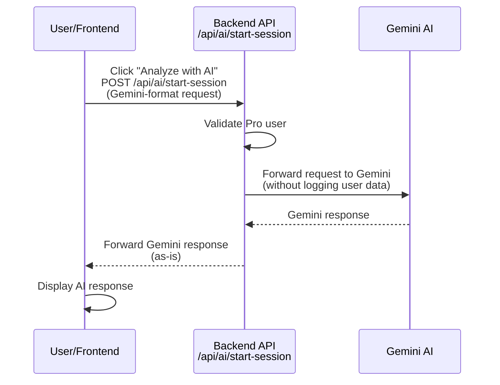

# AI Session Implementation

## Overview
The `startAISession` endpoint enables Pro users to interact with Gemini AI while keeping the master API key secure on the backend. The backend acts as a secure proxy, forwarding requests to Gemini without logging user data.

## Flow Diagram



## Architecture

### Backend (`POST /api/ai/start-session`)
1. Validates Pro user status (logs only userId, not content)
2. Retrieves Gemini API key from Key Vault
3. Forwards request body to Gemini API without parsing or logging user data
4. Returns Gemini's response as-is to frontend

**Privacy**: User prompts and sensitive data are forwarded directly to Gemini without being logged or stored by our backend.

### Frontend
1. Builds Gemini-format request with user data:
   ```typescript
   const request = {
     contents: [{ parts: [{ text: userPrompt }] }],
     generationConfig: { temperature: 0.2, maxOutputTokens: 4000 }
   };
   ```
2. Calls `/api/ai/start-session` (authenticated with Bearer token)
3. Receives and displays Gemini's response

**Key Point**: User data goes through our backend proxy but is NOT logged - it's forwarded directly to Gemini.

## API Reference

**Endpoint**: `POST /api/ai/start-session`  
**Authentication**: Pro users only

**Request**:
```json
{
  "contents": [
    {
      "parts": [
        {
          "text": "User prompt with sensitive data"
        }
      ]
    }
  ],
  "generationConfig": {
    "temperature": 0.2,
    "maxOutputTokens": 4000,
    "topP": 0.8,
    "topK": 40
  }
}
```

**Response** (Gemini format):
```json
{
  "candidates": [
    {
      "content": {
        "parts": [
          {
            "text": "AI response text"
          }
        ]
      },
      "finishReason": "STOP"
    }
  ],
  "usageMetadata": {
    "promptTokenCount": 100,
    "candidatesTokenCount": 200,
    "totalTokenCount": 300
  }
}
```

## Implementation Files

### Backend
- `api/src/functions/startAISession.ts` - Secure proxy endpoint
- `api/src/index.ts` - Function registration
- `public/api-docs/openapi.json` - API documentation

### Frontend
- `src/components/BGOverviewReport/TimeInRangeDetailsCard.tsx` - UI component
- `src/utils/api/startAISessionApi.ts` - Type-safe API client

### Translations
Added for 4 languages (en, de, cs, sr) in `public/locales/*/reports.json`:
- `analyzeButton`, `analyzingButton`, `readingsInRange`, `aiResponse`, `errorPrefix`

## Security

- **API Key Protection**: Master API key never exposed to frontend
- **User Data Privacy**: User prompts and data are NOT logged by backend
- **Pro User Validation**: Enforced on backend before proxying requests
- **Direct to Gemini**: User data flows directly to Gemini AI through our proxy

## Architecture Change (v1.8.x)

**Previous approach (deprecated)**: Used ephemeral tokens from `v1alpha/authTokens:generate` endpoint
- Backend generated ephemeral tokens for frontend
- Frontend used tokens to call Gemini directly
- **Issue**: Google deprecated the ephemeral token endpoint (404 error)

**Current approach**: Secure proxy pattern
- Backend validates Pro user and forwards requests to Gemini
- User data is NOT logged - goes directly to Gemini via proxy
- Simpler flow with single request instead of two steps
- **Note**: Ephemeral tokens are only available for Live API (WebSocket), not REST API

## Testing

- Unit tests: All passing
- Build: Frontend and backend successful
- Linting: No errors
- All translations verified
