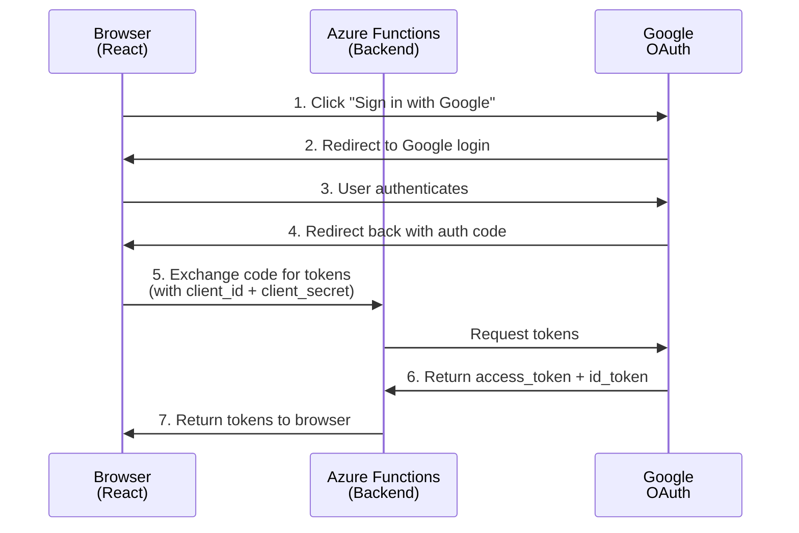

# Google OAuth Authorization Code Flow

This document describes the OAuth 2.0 Authorization Code Flow implementation for Google authentication in GlookoDataWebApp.

## Overview

The application uses the **Authorization Code Flow** for Google authentication, which is more secure than the implicit flow. This flow keeps the client secret on the backend and exchanges authorization codes for tokens server-side.

## Flow Diagram



## Redirect URIs

The following redirect URIs must be configured in Google Cloud Console:

### Production
- `https://glooko.iric.online/auth/callback` - Main production domain

### Development
- `http://localhost:5173/auth/callback` - Local development
- `http://localhost:5173` - Alternative local development

### Configuration Steps
1. Go to [Google Cloud Console](https://console.cloud.google.com/)
2. Navigate to **APIs & Services** > **Credentials**
3. Select your OAuth 2.0 Client ID
4. Under **Authorized redirect URIs**, add all the URIs listed above
5. Save changes

## Required OAuth Scopes

The application requests the following OAuth 2.0 scopes:

- `openid` - Required for OpenID Connect authentication
- `profile` - Access to user's basic profile information (name, picture)
- `email` - Access to user's email address

These scopes are defined in `src/config/googleConfig.ts`.

## Environment Variables

### Frontend (React App)

Environment variables for the frontend must use the `VITE_` prefix to be accessible in the browser.

| Variable Name | Purpose | Where to Set |
|--------------|---------|--------------|
| `VITE_GOOGLE_CLIENT_ID` | Google OAuth Client ID | GitHub repo variables (CI/CD) or `.env.local` (local dev) |

**Local Development:**
Create a `.env.local` file in the project root:
```bash
VITE_GOOGLE_CLIENT_ID=your-client-id.apps.googleusercontent.com
```

**CI/CD (GitHub Actions):**
Set as a repository variable in GitHub:
1. Go to repository Settings > Secrets and variables > Actions > Variables
2. Create variable: `GOOGLE_CLIENT_ID` (without `VITE_` prefix)
3. The workflow will automatically inject it as `VITE_GOOGLE_CLIENT_ID` during build

### Backend (Azure Functions)

Environment variables for the backend use standard naming (no prefix).

| Variable Name | Purpose | Where to Set |
|--------------|---------|--------------|
| `GOOGLE_CLIENT_ID` | Google OAuth Client ID | Azure Function App Settings or `api/local.settings.json` |
| `GOOGLE_CLIENT_SECRET` | Google OAuth Client Secret | Azure Function App Settings or `api/local.settings.json` |

**Local Development:**
Copy `api/local.settings.json.template` to `api/local.settings.json` and fill in:
```json
{
  "IsEncrypted": false,
  "Values": {
    "GOOGLE_CLIENT_ID": "your-client-id.apps.googleusercontent.com",
    "GOOGLE_CLIENT_SECRET": "your-client-secret"
  }
}
```

**Production (Azure):**
1. Go to Azure Portal > Function App > Configuration
2. Add Application Settings:
   - `GOOGLE_CLIENT_ID`: Your Google OAuth Client ID
   - `GOOGLE_CLIENT_SECRET`: Your Google OAuth Client Secret
3. Save and restart the Function App

## Security Considerations

### ✅ What's Safe

1. **Client ID in frontend code**: The `VITE_GOOGLE_CLIENT_ID` is safe to expose in the browser. It's designed to be public.
2. **Authorization code in URL**: The auth code is single-use, expires quickly, and is useless without the client secret.
3. **Tokens in browser memory**: ID and access tokens are stored in browser memory (React state) and cleared on logout.

### ⚠️ What Must Be Protected

1. **Client Secret**: The `GOOGLE_CLIENT_SECRET` must NEVER be in:
   - Frontend code
   - `.env.local` (frontend)
   - Git repository
   - Browser console/network tab
   
   It should ONLY be in:
   - Azure Function App Settings (production)
   - `api/local.settings.json` (local backend, not committed to git)

2. **Authorization Code**: Should only be used once and immediately exchanged for tokens.

### Verification Checklist

Before deploying, verify:

- [ ] `GOOGLE_CLIENT_SECRET` is not in any frontend files
- [ ] `api/local.settings.json` is in `.gitignore`
- [ ] Browser Network tab shows no `client_secret` parameter in any requests
- [ ] Only the backend API calls Google's token endpoint
- [ ] Frontend only receives tokens, never sends the client secret

## API Endpoint

### Token Exchange Endpoint

**Endpoint:** `POST /api/auth/google/token`

**Request:**
```json
{
  "code": "authorization_code_from_google",
  "redirect_uri": "https://glooko.iric.online/auth/callback"
}
```

**Response (Success):**
```json
{
  "access_token": "ya29.a0...",
  "id_token": "eyJhbGciOiJSUzI1NiIs...",
  "expires_in": 3599
}
```

**Response (Error):**
```json
{
  "error": "Invalid or expired authorization code"
}
```

## Local Development Setup

### 1. Frontend Setup

```bash
# Copy environment template
cp .env.local.example .env.local

# Edit .env.local and add your Client ID
# VITE_GOOGLE_CLIENT_ID=your-client-id.apps.googleusercontent.com

# Install dependencies
npm install

# Start development server
npm run dev
```

### 2. Backend Setup

```bash
# Navigate to API directory
cd api

# Copy settings template
cp local.settings.json.template local.settings.json

# Edit local.settings.json and add your credentials
# GOOGLE_CLIENT_ID and GOOGLE_CLIENT_SECRET

# Install dependencies
npm install

# Start Azure Functions
npm start
```

### 3. Test the Flow

1. Open `http://localhost:5173` in your browser
2. Click "Sign in with Google"
3. Authorize the application
4. Verify you're redirected back and logged in
5. Open browser DevTools > Network tab
6. Confirm `client_secret` does not appear in any requests

## Production Deployment

### GitHub Actions Workflow

The deployment workflow (`.github/workflows/azure-static-web-apps-wonderful-stone-071384103.yml`) automatically injects the Client ID during build:

```yaml
- name: Build And Deploy Static Web App
  env:
    VITE_GOOGLE_CLIENT_ID: ${{ vars.GOOGLE_CLIENT_ID }}
  with:
    # ... deployment configuration
```

### Azure Function App Configuration

Set the following Application Settings in Azure Portal:

1. Navigate to Function App > Configuration
2. Add new application settings:
   - `GOOGLE_CLIENT_ID`: Your Client ID
   - `GOOGLE_CLIENT_SECRET`: Your Client Secret
3. Save changes
4. Restart the Function App

## Troubleshooting

### "redirect_uri_mismatch" Error

**Cause:** The redirect URI in the request doesn't match any configured in Google Cloud Console.

**Solution:**
1. Check the exact URL in the error message
2. Add that URL to Authorized redirect URIs in Google Cloud Console
3. Ensure it matches exactly (including protocol, domain, port, and path)

### "Invalid client" Error

**Cause:** The Client ID or Client Secret is incorrect.

**Solution:**
1. Verify `GOOGLE_CLIENT_ID` in both frontend and backend
2. Verify `GOOGLE_CLIENT_SECRET` in backend
3. Ensure they match the credentials in Google Cloud Console

### Tokens Not Being Returned

**Cause:** Backend function not running or environment variables not set.

**Solution:**
1. Check Azure Function logs in Application Insights
2. Verify environment variables are set in Azure Function App Settings
3. Test the `/api/auth/google/token` endpoint directly

### "CORS Error" in Browser

**Cause:** CORS not configured for the frontend domain.

**Solution:**
1. In Azure Static Web Apps, CORS is handled automatically
2. For Azure Functions, ensure the frontend domain is in allowed origins

## Additional Resources

- [Google OAuth 2.0 Documentation](https://developers.google.com/identity/protocols/oauth2)
- [Authorization Code Flow](https://developers.google.com/identity/protocols/oauth2/web-server)
- [Azure Functions HTTP Triggers](https://learn.microsoft.com/en-us/azure/azure-functions/functions-bindings-http-webhook)
- [Vite Environment Variables](https://vitejs.dev/guide/env-and-mode.html)
