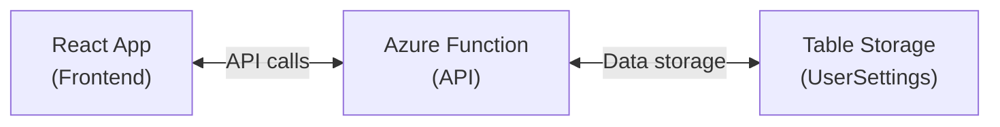

# First Login API

This document describes the first login check API implementation in the GlookoDataWebApp.

## Overview

The first login check API allows the application to determine if a user is logging in for the first time. This enables displaying a welcome message to new users and tracking user registrations.

## Architecture



## Flow

1. User successfully logs in via Microsoft Authentication
2. Frontend calls `/api/user/check-first-login` with the access token
3. Azure Function validates the token and checks UserSettings table
4. Response indicates if this is a first-time login
5. Frontend displays appropriate dialog (welcome or nothing)

## API Endpoint

### GET /api/user/check-first-login

Checks if the current authenticated user is logging in for the first time.

**Headers:**
- `Authorization: Bearer <access_token>` (required)
- `Content-Type: application/json`

**Success Response (200 OK):**
```json
{
  "isFirstLogin": true,
  "userId": "user-unique-id"
}
```

**Error Responses:**

| Status | Description | errorType |
|--------|-------------|-----------|
| 401 | Invalid or expired token | `unauthorized` |
| 403 | Insufficient permissions | `unauthorized` |
| 500+ | Server/Infrastructure error | `infrastructure` |
| Other | General API error | `unknown` |

**Error Response Format:**
```json
{
  "error": "Error description",
  "errorType": "infrastructure",
  "code": "STORAGE_CONNECTION_FAILED"
}
```

## Configuration

### Frontend Configuration

The API client is configured in `src/utils/api/userSettingsApi.ts`:

```typescript
// Default configuration - uses Azure Static Web App's API proxy
const defaultConfig: UserSettingsApiConfig = {
  baseUrl: '/api',
};
```

**Customizing the base URL:**

```typescript
import { checkFirstLogin } from './utils/api/userSettingsApi';

// Use a custom API endpoint
const result = await checkFirstLogin(accessToken, {
  baseUrl: 'https://my-function-app.azurewebsites.net/api'
});
```

### Azure Static Web Apps Configuration

When deployed to Azure Static Web Apps, the `/api/*` routes are automatically proxied to the linked Azure Function App. No additional configuration is needed.

**Local Development:**

For local development, you can configure the proxy in `vite.config.ts`:

```typescript
export default defineConfig({
  server: {
    proxy: {
      '/api': {
        target: 'http://localhost:7071',  // Azure Functions local port
        changeOrigin: true,
      },
    },
  },
});
```

Or use the Azure Functions Core Tools to run the function locally.

## Security

### Authentication

- The API requires a valid Microsoft access token in the Authorization header
- Tokens are validated by Azure Functions using Azure AD integration
- Unauthenticated requests return 401 Unauthorized

### Data Protection

- Access tokens are not stored on the client beyond the session
- User IDs in Table Storage are derived from the authenticated identity
- No sensitive data is transmitted in API responses

### Best Practices

1. **Token Handling**: Access tokens are managed by MSAL and automatically refreshed
2. **Error Handling**: All API errors are caught and displayed appropriately
3. **Rate Limiting**: Consider implementing rate limiting on the Azure Function
4. **CORS**: Configure CORS on the Azure Function to allow only your domains

## Error Handling

The frontend handles different error scenarios:

| Scenario | User Experience |
|----------|-----------------|
| Infrastructure not ready | Error dialog explaining service unavailability |
| Network error | Error dialog suggesting to check connection |
| Unauthorized | Error dialog suggesting to login again |
| API returns isFirstLogin: true | Welcome dialog with "Welcome to our app!" |
| API returns isFirstLogin: false | No dialog shown |

## Dialogs

### WelcomeDialog

Displayed for first-time users:
- Personalized greeting if user name is available
- Brief description of the application
- OK button to dismiss

### InfrastructureErrorDialog

Displayed when API errors occur:
- Clear error message based on error type
- HTTP status code when available
- Technical details in monospace font
- OK button to dismiss

## Testing

### Unit Tests

Run the test suite:

```bash
npm test
```

Tests cover:
- API client error handling
- Hook state management
- Dialog rendering
- Navigation integration

### Manual Testing

To test the first login flow:

1. Clear browser storage (to reset MSAL cache)
2. Navigate to the application
3. Click Login and authenticate
4. Observe the API call in DevTools Network tab
5. If infrastructure is not set up, error dialog appears
6. If infrastructure is set up and user is new, welcome dialog appears

## Future Enhancements

- Store user's first login timestamp in Table Storage
- Track login history for security auditing
- Add user preferences to the UserSettings table
- Implement onboarding flow after welcome dialog
