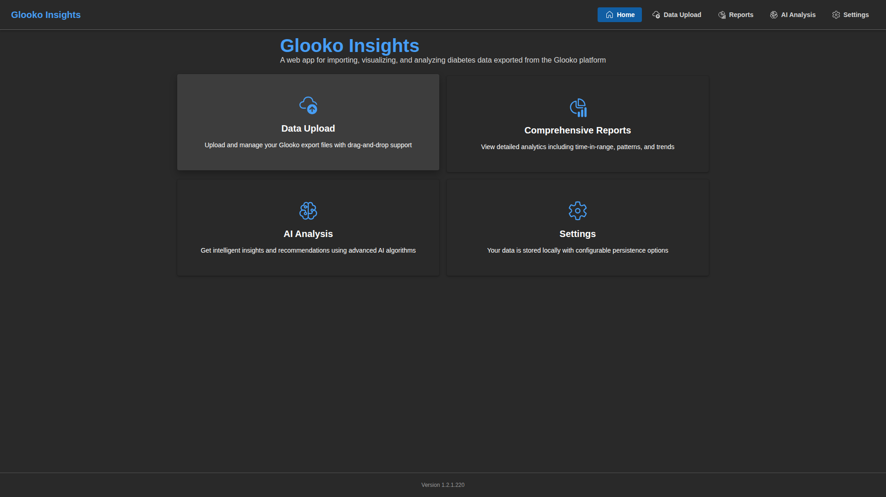

# Application Screenshots

This page provides comprehensive visual documentation of the GlookoDataWebApp interface across different themes and device types.

## Overview

GlookoDataWebApp is a modern web application for importing, visualizing, and analyzing diabetes data exported from the Glooko platform. The application features:

- **Microsoft Fluent UI Design** - Clean, modern interface with professional styling
- **Multi-Theme Support** - Light mode, dark mode, and system preference detection
- **Fully Responsive** - Optimized for desktop, tablet, and mobile devices
- **Privacy-First** - All data processing happens in the browser, no server transmission
- **AI-Powered Analysis** - Intelligent insights using advanced AI algorithms
- **Comprehensive Reports** - Detailed analytics including time-in-range, AGP, and insulin data

## Screenshot Collections

We've organized our screenshots into three comprehensive collections based on theme and device type:

### 📋 [All Screenshots in One Page](screenshots/ALL_SCREENSHOTS.md)

View **all 45 screenshots** from all themes and devices on a single page:

- Desktop Light Mode (15 screenshots)
- Desktop Dark Mode (15 screenshots)
- Mobile Dark Theme (15 screenshots)
- Each screenshot with a one-sentence description
- Complete visual walkthrough of all features

**Best for:** Complete overview, printing, offline reference, thorough documentation review

[→ View All Screenshots](screenshots/ALL_SCREENSHOTS.md)

---

### 📱 [Desktop - Light Mode](screenshots/SCREENSHOTS_LIGHT.md)

View the complete application interface in **Light Mode** on desktop displays (1920x1080):

- Home page with navigation cards
- Data Upload with file management
- Reports: File Info, Time in Range, AGP Data, Detailed CGM, Detailed Insulin
- AI Analysis: All five analysis tabs (File Info, Time in Range, Glucose & Insulin, Meal Timing, Pump Settings)
- Settings: General, Data & AI, About

**Best for:** Daytime use, bright environments, users who prefer traditional light interfaces

[→ View Light Mode Screenshots](screenshots/SCREENSHOTS_LIGHT.md)

---

### 🌙 [Desktop - Dark Mode](screenshots/SCREENSHOTS_DARK.md)

View the complete application interface in **Dark Mode** on desktop displays (1920x1080):

- All pages and features in dark theme
- High contrast design for reduced eye strain
- Optimal for low-light environments
- Lower power consumption on OLED displays
- Same comprehensive coverage as light mode

**Best for:** Night time use, low-light environments, reduced eye strain, OLED power savings

[→ View Dark Mode Screenshots](screenshots/SCREENSHOTS_DARK.md)

---

### 📱 [Mobile - Dark Theme](screenshots/SCREENSHOTS_MOBILE.md)

View the complete application interface optimized for **mobile devices** (375x812 - iPhone size) with dark theme:

- Touch-optimized interface
- Responsive single-column layout
- All features accessible on mobile
- Vertical tab navigation
- Mobile-friendly charts and tables

**Best for:** On-the-go access, smartphone usage, tablet viewing

[→ View Mobile Screenshots](screenshots/SCREENSHOTS_MOBILE.md)

---

## Quick Preview

Here's a quick preview of the home page across different themes:

### Desktop Light Mode

### Desktop Dark Mode

### Mobile Dark Theme

---

## Application Features

### 📂 Data Upload
- Drag-and-drop ZIP file upload
- Intelligent CSV validation
- Metadata extraction (patient info, date ranges)
- Column detection with colored tags
- Export to CSV/XLSX format

### 📊 Comprehensive Reports
- **File Info**: Complete metadata display
- **Time in Range**: Glucose range analysis (3 or 5 categories)
- **AGP Data**: Ambulatory Glucose Profile with percentiles
- **Detailed CGM**: Complete glucose readings table
- **Detailed Insulin**: Bolus and basal insulin data

### 🧠 AI Analysis
- **Multiple AI Providers**: Perplexity, Google Gemini, Grok, DeepSeek
- **Time in Range Analysis**: AI-powered insights on glucose control
- **Glucose & Insulin Correlation**: Pattern recognition and recommendations
- **Meal Timing Analysis**: Optimize meal and insulin timing
- **Pump Settings Review**: Basal rate and sensitivity recommendations

### ⚙️ Settings
- **Theme Selection**: Light, Dark, or System preference
- **Glucose Thresholds**: Customizable ranges for Low/High alerts
- **Data Persistence**: Optional session storage
- **Export Format**: Choose CSV or XLSX
- **AI Configuration**: Manage API keys for multiple providers

---

## Design Principles

### Accessibility
- WCAG 2.1 compliant contrast ratios
- Screen reader support with ARIA labels
- Keyboard navigation throughout
- Focus indicators for all interactive elements

### Responsive Design
- Desktop (1920x1080 and above)
- Tablet (768px - 1919px)
- Mobile (375px - 767px)
- No horizontal scrolling on any device
- Touch-optimized controls on mobile

### Performance
- Fast loading times
- Efficient data processing
- Smooth animations and transitions
- Optimized for mobile networks

### Privacy & Security
- Client-side only processing
- No data transmitted to servers
- Local storage for preferences
- Secure API key storage

---

## Navigation

All pages feature consistent navigation with:
- **Top Navigation Bar**: Quick access to all sections
- **Active Page Indicator**: Visual highlight of current page
- **Responsive Menu**: Adapts to device size
- **Footer**: Version information and build number

---

## Related Documentation

### User Guides
- [Main README](../README.md) - Project overview and quick start
- [Quick Start Guide](../QUICKSTART.md) - Get started in 5 minutes
- [Data Upload Guide](DATA_UPLOAD.md) - Detailed upload instructions
- [Reports Documentation](REPORTS.md) - Understanding reports
- [Settings Guide](SETTINGS.md) - Configure the application

### Developer Documentation
- [Contributing Guide](../CONTRIBUTING.md) - How to contribute
- [E2E Testing Guide](E2E_TESTING.md) - Playwright testing
- [README Automation](README_AUTOMATION.md) - Documentation automation

---

## Version Information

Screenshots current as of version **1.4.0** (November 2024).

For the latest updates and changes, see the [CHANGELOG](../CHANGELOG.md).

---

**Note:** All screenshots show the application with demo data loaded. Your actual data will appear in place of the demo data when you upload your own Glooko export files.
