# Desktop Screenshots - Dark Mode

This page showcases the GlookoDataWebApp interface in **Dark Mode** on desktop displays (1920x1080).

## Table of Contents

- [Home Page](#home-page)
- [Data Upload](#data-upload)
- [Reports](#reports)
  - [File Info](#reports---file-info)
  - [Time in Range](#reports---time-in-range)
  - [AGP Data](#reports---agp-data)
  - [Detailed CGM](#reports---detailed-cgm)
  - [Detailed Insulin](#reports---detailed-insulin)
- [AI Analysis](#ai-analysis)
  - [File Info](#ai-analysis---file-info)
  - [Time in Range](#ai-analysis---time-in-range)
  - [Glucose & Insulin](#ai-analysis---glucose--insulin)
  - [Meal Timing](#ai-analysis---meal-timing)
  - [Pump Settings](#ai-analysis---pump-settings)
- [Settings](#settings)
  - [General](#settings---general)
  - [Data & AI](#settings---data--ai)
  - [About](#settings---about)

---

## Home Page

The home page in dark mode features:
- High contrast design with dark background
- Reduced eye strain for low-light environments
- Microsoft Fluent UI dark theme tokens
- Four main navigation cards with blue accents
- Consistent branding with light mode

---

## Data Upload

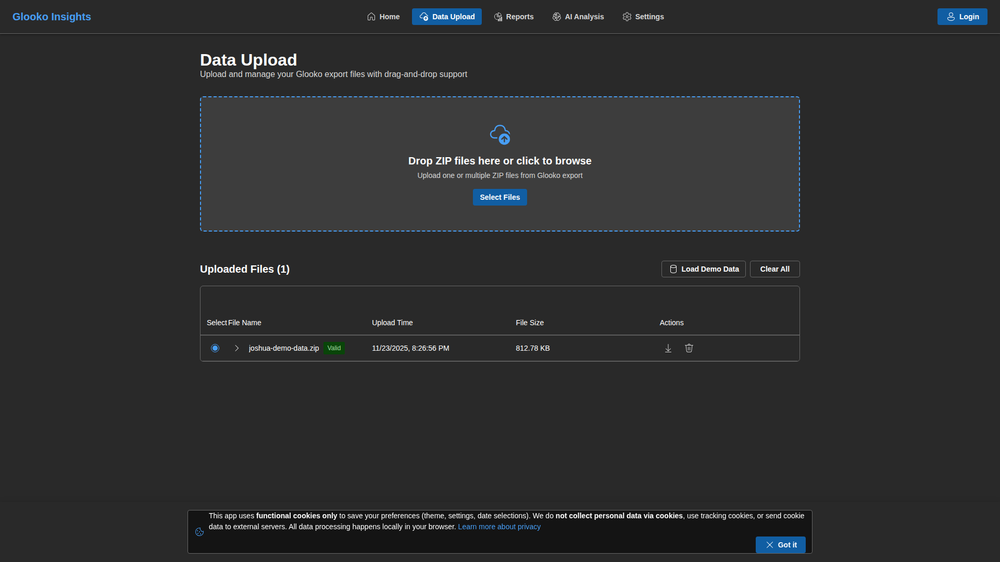

The Data Upload page in dark mode displays:
- Dark background with light text for readability
- Demo data file with metadata
- Green "Valid" badge for validated files
- Expandable details accordion
- Action buttons with appropriate contrast
- Drag-and-drop zone with subtle borders

**Dark Mode Benefits:**
- Reduced blue light exposure
- Better visibility in dim lighting
- Lower power consumption on OLED displays
- Comfortable for extended use

---

## Reports

### Reports - File Info

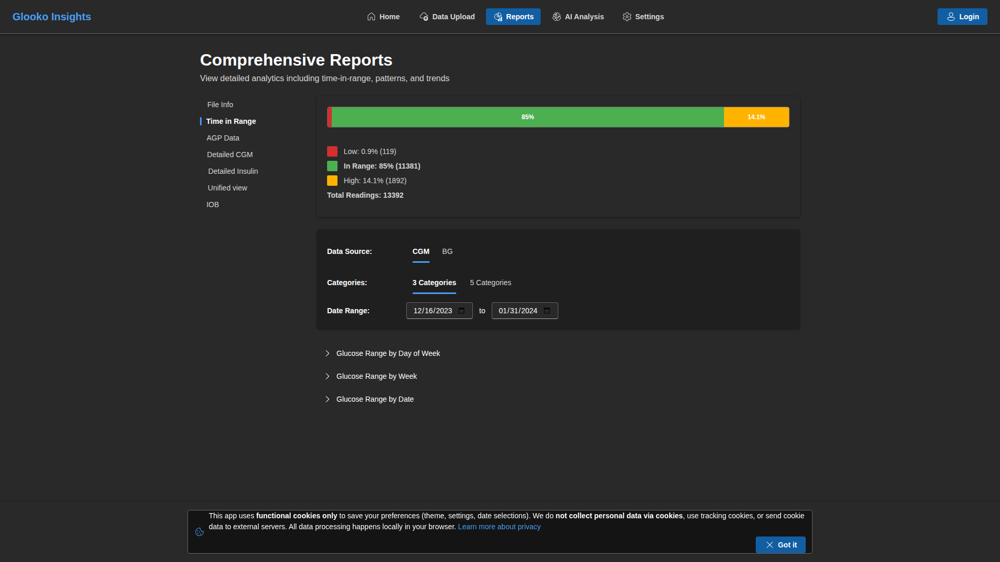

The File Info tab in dark mode shows:
- Dark card backgrounds
- Light text for metadata information
- Colored tags for CSV file types
- Clear hierarchy and spacing
- High contrast for important information

### Reports - Time in Range

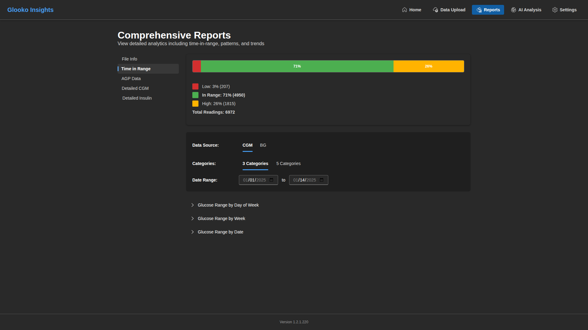

The Time in Range report in dark mode features:
- Dark background for charts and graphs
- Vibrant colors for different glucose ranges
- Toggle switch with dark theme styling
- Day-of-week breakdown with visible bars
- Daily trend chart with maintained color coding

**Color Palette in Dark Mode:**
- Very Low: Dark red/orange
- Low: Orange/yellow
- In Range: Green
- High: Yellow/orange
- Very High: Red

### Reports - AGP Data

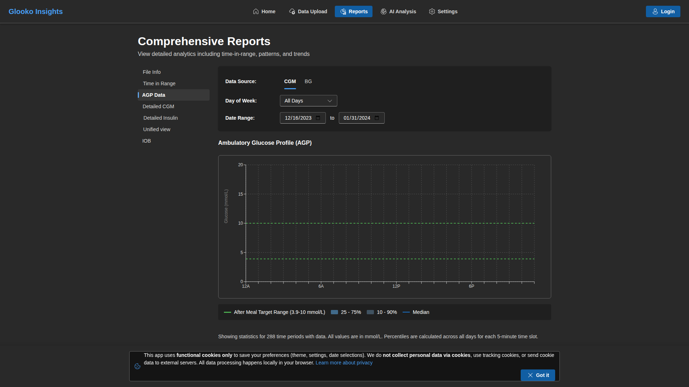

The AGP report in dark mode provides:
- Dark chart background
- Clear percentile lines
- Readable axis labels
- Statistical table with dark styling
- Gradient fills for percentile ranges

### Reports - Detailed CGM

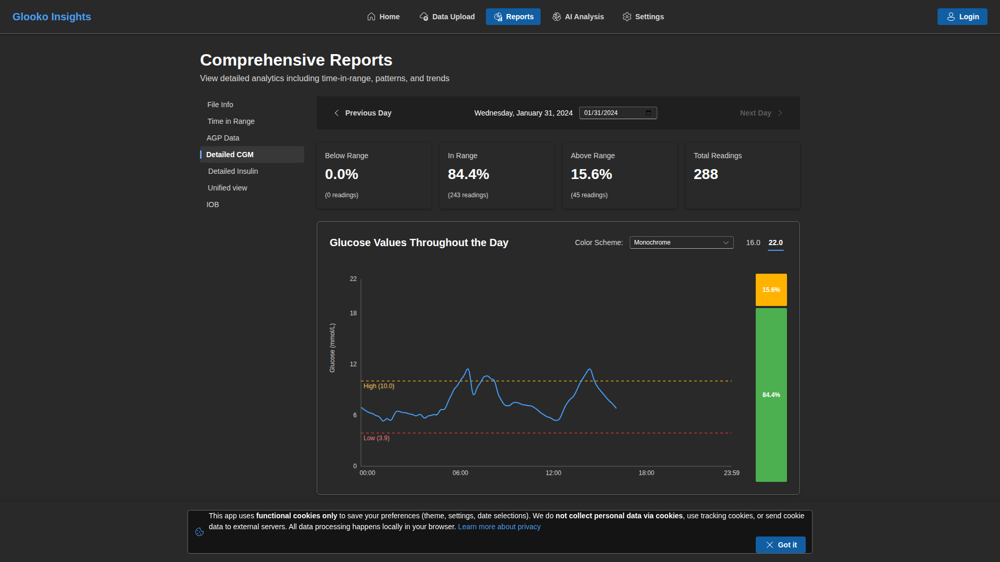

The Detailed CGM tab in dark mode shows:
- Dark table with alternating row colors
- Light text for glucose values
- Timestamp formatting
- Pagination controls with dark theme
- Search and filter options

### Reports - Detailed Insulin

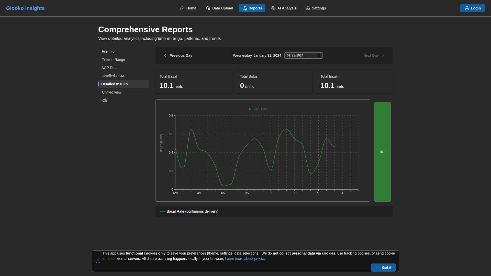

The Detailed Insulin report in dark mode displays:
- Dark table backgrounds
- Clear column headers
- Insulin type and value columns
- Sortable data with dark theme indicators
- Summary statistics at the bottom

---

## AI Analysis

### AI Analysis - File Info

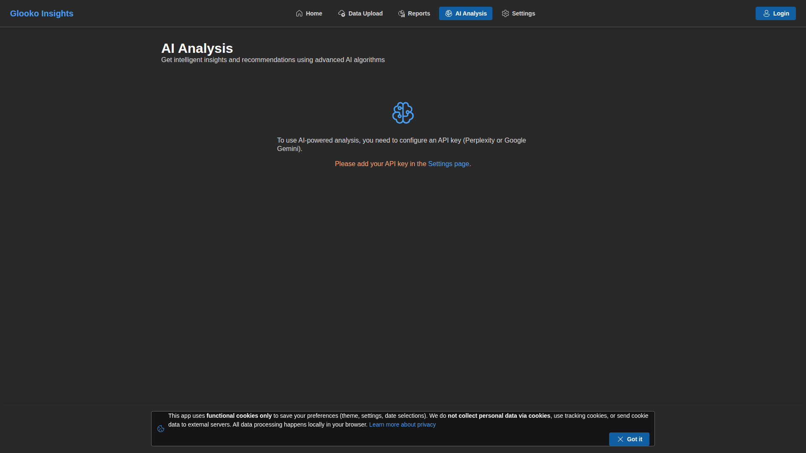

The File Info tab maintains consistency with the Reports section, showing metadata in an easily readable dark theme format.

### AI Analysis - Time in Range

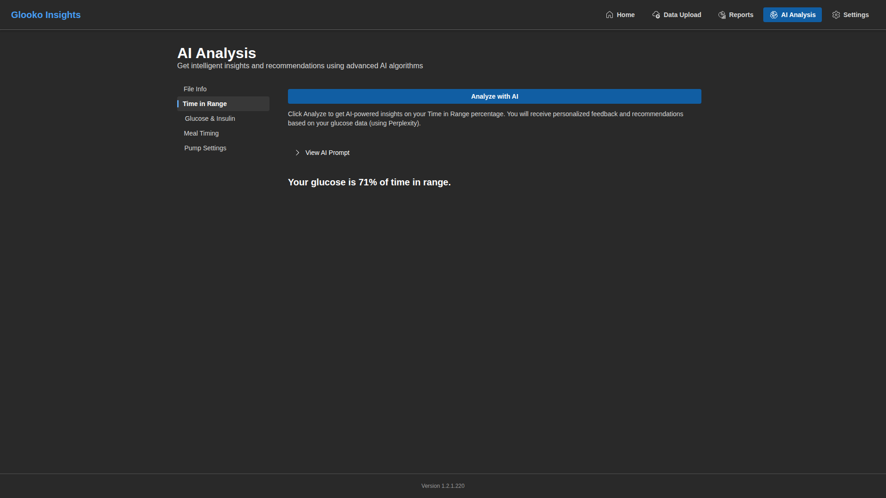

The Time in Range AI analysis in dark mode features:
- Dark "Analyze with AI" button with blue accent
- Loading spinner with appropriate colors
- Message bars with dark backgrounds
- Accordion components in dark theme
- Placeholder text with reduced opacity

### AI Analysis - Glucose & Insulin

The Glucose & Insulin analysis tab in dark mode:
- Combined dataset view in dark table
- AI prompt accordion with syntax highlighting
- Analysis results area
- Dark-themed markdown rendering
- Code blocks with appropriate contrast

### AI Analysis - Meal Timing

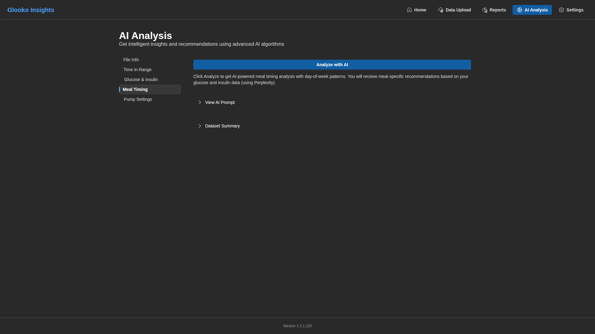

The Meal Timing analysis in dark mode:
- Meal data table with dark styling
- Time-based analysis view
- Dark accordion for dataset preview
- AI-generated insights area
- Recommendations in dark theme

### AI Analysis - Pump Settings

The Pump Settings analysis in dark mode:
- Dark cards for pump configuration data
- Basal rate charts with dark background
- Settings tables with proper contrast
- AI recommendations area
- Adjustable parameters in dark theme

---

## Settings

### Settings - General

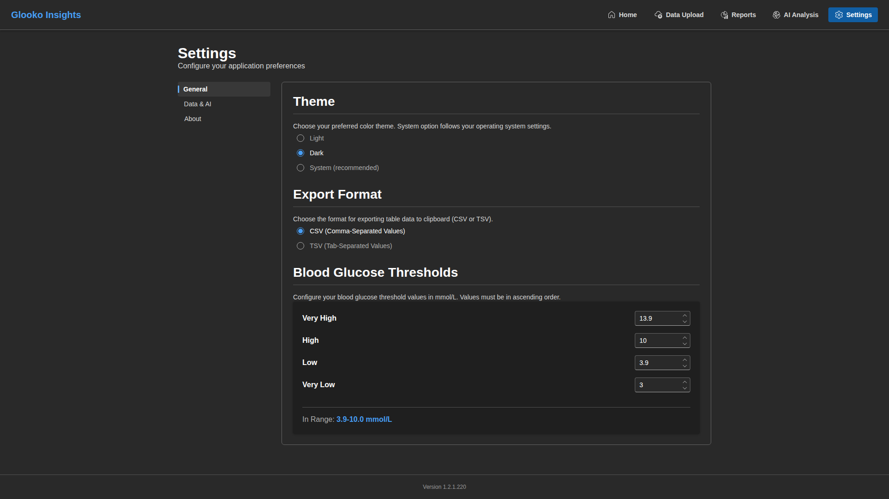

The General settings in dark mode include:
- **Dark Theme Selected**: Radio button shows current selection
- **Glucose Thresholds**: Dark input fields with light text
  - Slider controls with dark theme styling
  - Real-time value updates
  - Clear threshold markers
- **Units Display**: mmol/L in dark theme
- Form controls with appropriate contrast

### Settings - Data & AI

The Data & AI settings in dark mode provide:
- **Export Format Dropdown**: Dark dropdown menu
- **Data Persistence Toggle**: Dark switch component
- **AI Provider Selection**: Radio buttons in dark theme
  - Perplexity option
  - Google Gemini option
  - Grok (X.AI) option
  - DeepSeek option
- **API Key Fields**: Password inputs with dark background
  - Eye icon to show/hide keys
  - Save and clear buttons
- Form sections with clear separators

### Settings - About

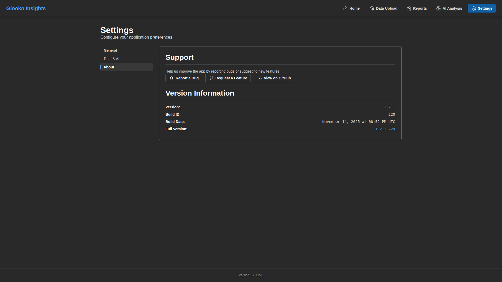

The About tab in dark mode displays:
- Version information in light text
- Build number clearly visible
- Links styled for dark theme
- Blue accent for interactive elements
- Readable legal text
- Credits and acknowledgments section

---

## Dark Mode Features

### Theme Consistency
- All components use Fluent UI dark theme tokens
- Consistent color scheme throughout the app
- Proper contrast ratios for accessibility
- Smooth transitions when switching themes

### Visual Hierarchy
- Primary actions use blue accent color
- Secondary elements have reduced opacity
- Focus states are clearly visible
- Disabled states are appropriately dimmed

### Accessibility
- WCAG 2.1 compliant contrast ratios
- High visibility for interactive elements
- Clear focus indicators
- Readable text at all sizes

### Performance
- Reduced blue light for eye comfort
- Lower power consumption on OLED/AMOLED displays
- Seamless theme switching
- Persistent theme preference

---

## Navigation

Dark mode navigation features:
- **Top Bar**: Dark background with light text
- **Active Indicator**: Blue highlight maintains visibility
- **Icons**: Light colored for contrast
- **Hover States**: Subtle lightening effect
- **Footer**: Dark footer with version info

---

## Related Documentation

- [Light Mode Screenshots](SCREENSHOTS_LIGHT.md)
- [Mobile Screenshots](SCREENSHOTS_MOBILE.md)
- [Main Screenshots Overview](../SCREENSHOTS.md)
- [Data Upload Guide](../DATA_UPLOAD.md)
- [Reports Documentation](../REPORTS.md)
- [Settings Guide](../SETTINGS.md)
- [Main README](../../README.md)
