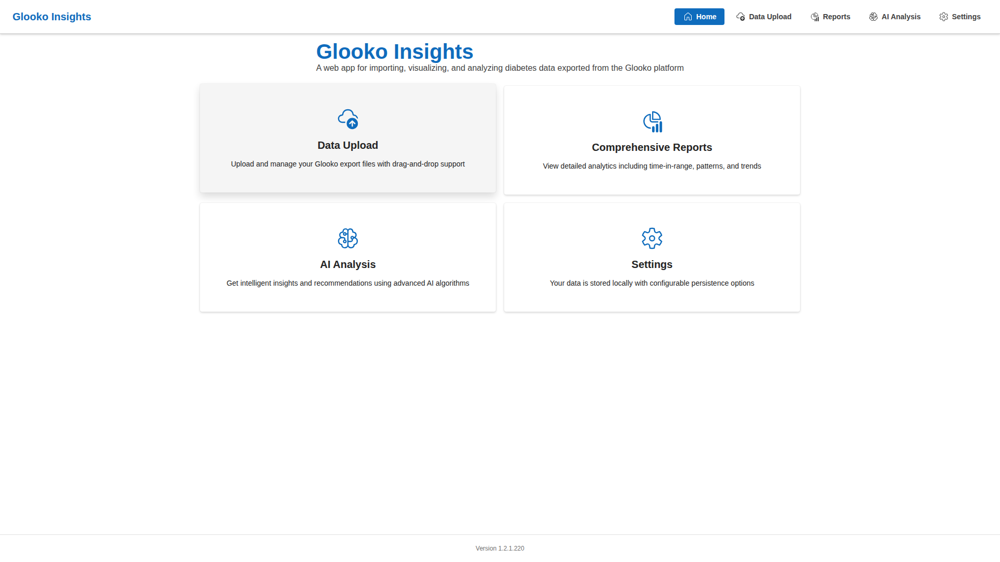
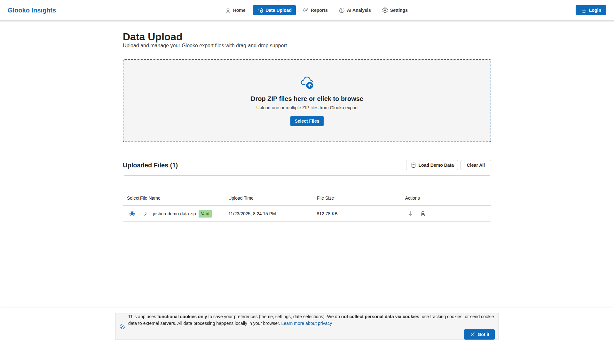
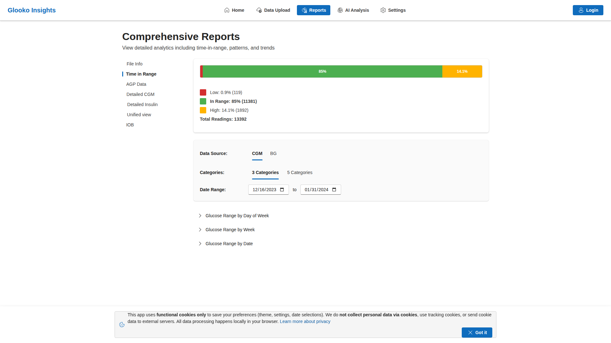
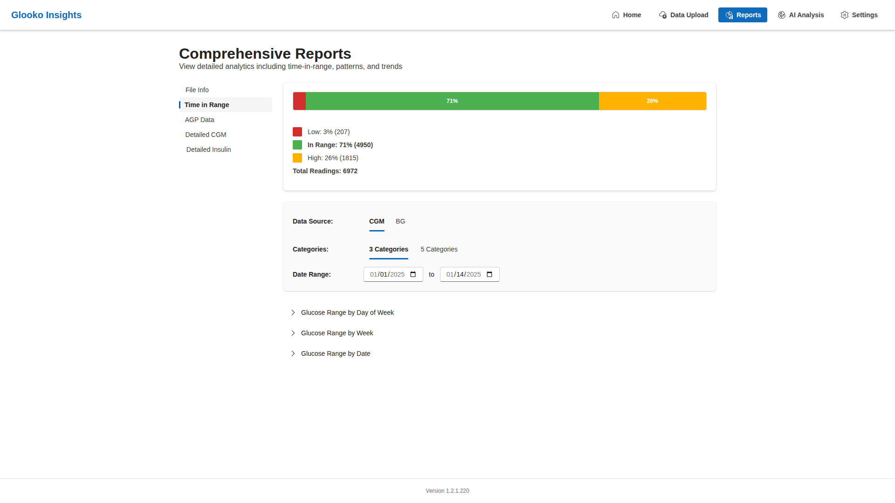
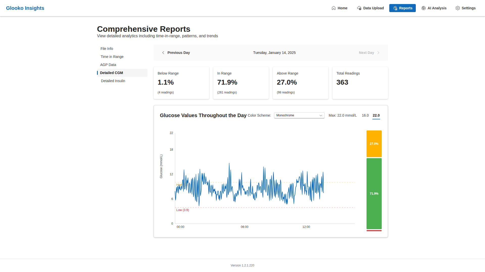
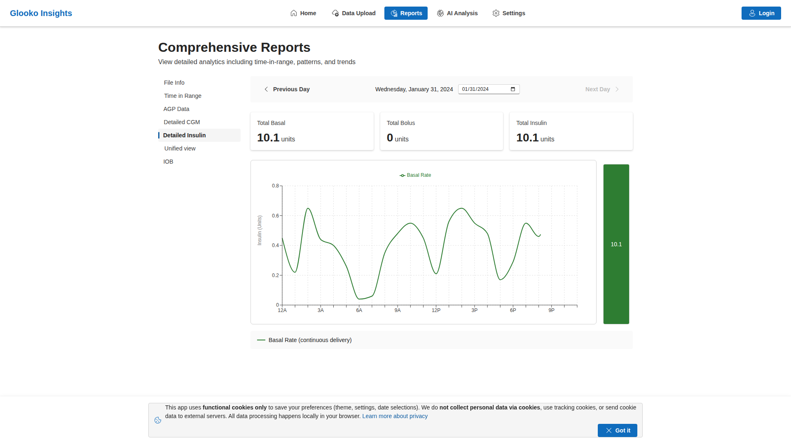
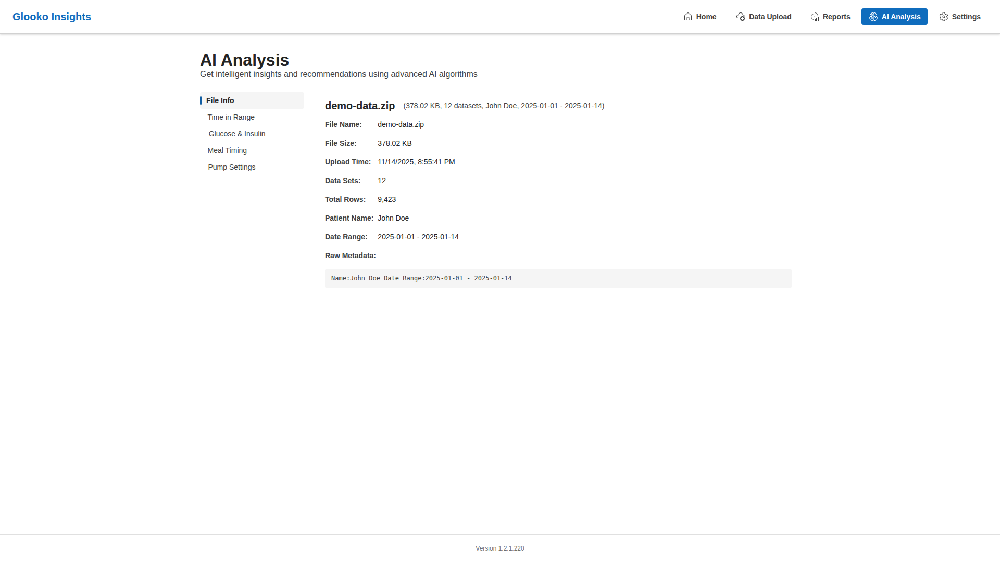
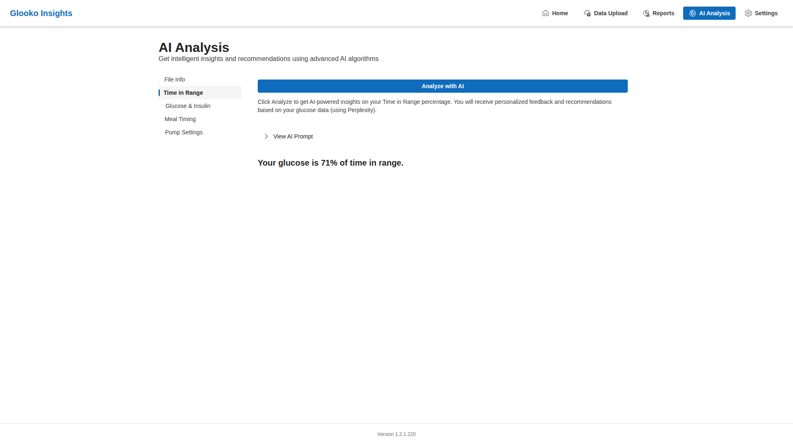
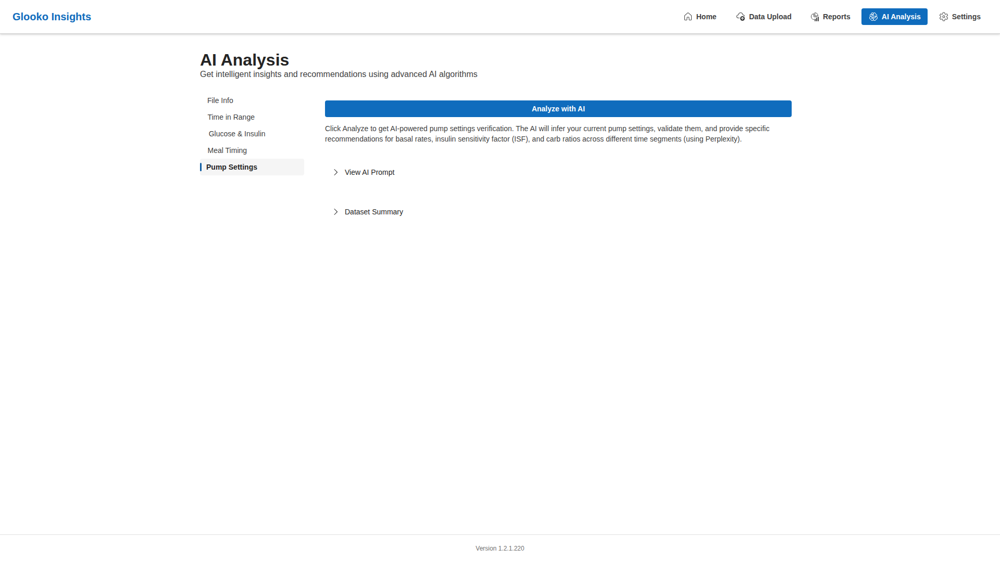
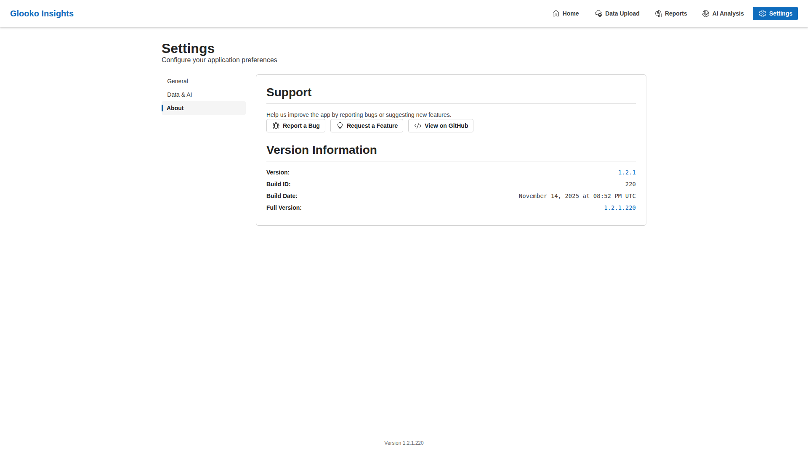

# Desktop Screenshots - Light Mode

This page showcases the GlookoDataWebApp interface in **Light Mode** on desktop displays (1920x1080).

## Table of Contents

- [Home Page](#home-page)
- [Data Upload](#data-upload)
- [Reports](#reports)
  - [File Info](#reports---file-info)
  - [Time in Range](#reports---time-in-range)
  - [AGP Data](#reports---agp-data)
  - [Detailed CGM](#reports---detailed-cgm)
  - [Detailed Insulin](#reports---detailed-insulin)
- [AI Analysis](#ai-analysis)
  - [File Info](#ai-analysis---file-info)
  - [Time in Range](#ai-analysis---time-in-range)
  - [Glucose & Insulin](#ai-analysis---glucose--insulin)
  - [Meal Timing](#ai-analysis---meal-timing)
  - [Pump Settings](#ai-analysis---pump-settings)
- [Settings](#settings)
  - [General](#settings---general)
  - [Data & AI](#settings---data--ai)
  - [About](#settings---about)

---

## Home Page

The home page features a modern, clean interface with four main navigation cards:
- **Data Upload** - Upload and manage Glooko export files
- **Comprehensive Reports** - View detailed analytics and trends
- **AI Analysis** - Get intelligent insights using AI algorithms
- **Settings** - Configure data persistence and theme preferences

---

## Data Upload

The Data Upload page shows an uploaded demo data file with:
- File name, size, and upload time
- Validation status (Valid/Invalid badge)
- Expandable details showing metadata, CSV files, and column information
- Actions: Delete file, Export to XLSX
- Drag-and-drop zone for adding more files

**Key Features:**
- Intelligent CSV validation
- Metadata extraction (patient info, date ranges)
- Column name detection with colored tags
- Accurate row counting (excluding headers)
- Browser-based processing for privacy

---

## Reports

### Reports - File Info

The File Info tab displays comprehensive metadata about the selected data file:
- Patient information
- Date range covered
- List of CSV files in the export
- Column headers and data row counts
- File validation status

### Reports - Time in Range

The Time in Range report provides glucose range analysis with:
- Toggle between 3-category and 5-category modes
- Day-of-week breakdown with visual bar charts
- Daily trend chart showing glucose ranges over time
- Color-coded ranges (Low, In Range, High, Very Low, Very High)
- Percentage calculations for each range

### Reports - AGP Data

The Ambulatory Glucose Profile (AGP) report shows:
- Statistical analysis of glucose readings
- Median, percentile ranges (10th, 25th, 75th, 90th)
- Time-based glucose patterns
- Visual representation of glucose variability
- Summary statistics table

### Reports - Detailed CGM

The Detailed CGM (Continuous Glucose Monitoring) tab provides:
- Complete table of glucose readings
- Timestamp, glucose value (mmol/L)
- Sortable and searchable data
- Pagination for large datasets
- Export capabilities

### Reports - Detailed Insulin

The Detailed Insulin report shows:
- Bolus insulin doses (meal/correction)
- Basal insulin rates
- Timestamps and values
- Insulin type and delivery method
- Daily summaries and totals

---

## AI Analysis

### AI Analysis - File Info

The File Info tab in AI Analysis section displays the same metadata as Reports, providing context for AI-powered analysis.

### AI Analysis - Time in Range

The Time in Range AI analysis tab features:
- "Analyze with AI" button for generating insights
- Summary statistics (In Range percentage)
- Accordion to view the AI prompt
- Placeholder for AI-generated analysis
- Support for multiple AI providers (Perplexity, Google Gemini, Grok, DeepSeek)

**Note:** API key required in Settings to enable AI analysis.

### AI Analysis - Glucose & Insulin

The Glucose & Insulin analysis tab provides:
- Combined analysis of CGM and insulin data
- Dataset preview in accordion
- AI prompt visibility for transparency
- Correlation insights between glucose and insulin
- Recommendations based on patterns

### AI Analysis - Meal Timing

The Meal Timing analysis examines:
- Relationship between meals and glucose levels
- Timing patterns and recommendations
- Pre-meal and post-meal glucose trends
- Bolus timing effectiveness
- Meal-specific insights

### AI Analysis - Pump Settings

The Pump Settings analysis evaluates:
- Basal rate effectiveness
- Insulin sensitivity factors
- Carbohydrate ratios
- Target glucose ranges
- Recommendations for pump adjustments

---

## Settings

### Settings - General

The General settings tab includes:
- **Theme Selection**: Light, Dark, or System preference
- **Glucose Thresholds**: Customizable ranges for Low, In Range, High
  - Very Low threshold
  - Low threshold
  - High threshold
  - Very High threshold
- **Units**: mmol/L (millimoles per liter)
- Real-time preview of threshold changes

### Settings - Data & AI

The Data & AI settings tab provides:
- **Export Format**: Choose between CSV and XLSX
- **Data Persistence**: Option to save data between sessions
- **AI Provider Selection**: Choose from multiple AI providers
  - Perplexity
  - Google Gemini
  - Grok (X.AI)
  - DeepSeek
- **API Key Management**: Securely store API keys for AI analysis
- Password-protected API key fields
- Clear/update individual API keys

### Settings - About

The About tab displays:
- Application version information
- Build number
- Links to documentation
- Repository information
- License details
- Credits and acknowledgments

---

## Navigation

All pages feature consistent navigation:
- **Top Navigation Bar**: Quick access to all sections
- **Active Page Indicator**: Blue highlight on current page
- **Responsive Design**: Adapts to different screen sizes
- **Footer**: Version information at the bottom

---

## Related Documentation

- [All Screenshots (Single Page)](ALL_SCREENSHOTS.md)
- [Dark Mode Screenshots](SCREENSHOTS_DARK.md)
- [Mobile Screenshots](SCREENSHOTS_MOBILE.md)
- [Main Screenshots Overview](../SCREENSHOTS.md)
- [Data Upload Guide](../DATA_UPLOAD.md)
- [Reports Documentation](../REPORTS.md)
- [Settings Guide](../SETTINGS.md)
- [Main README](../../README.md)
