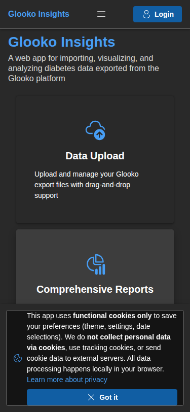
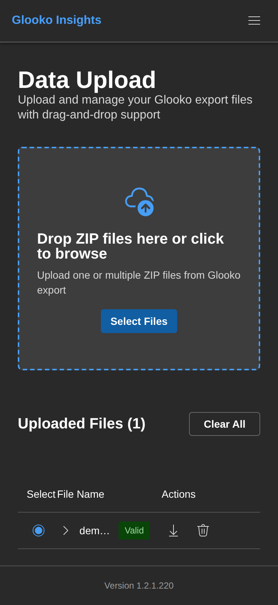
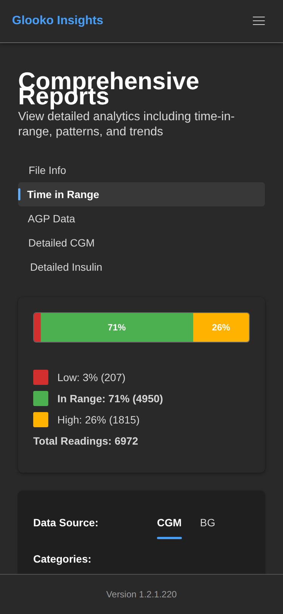
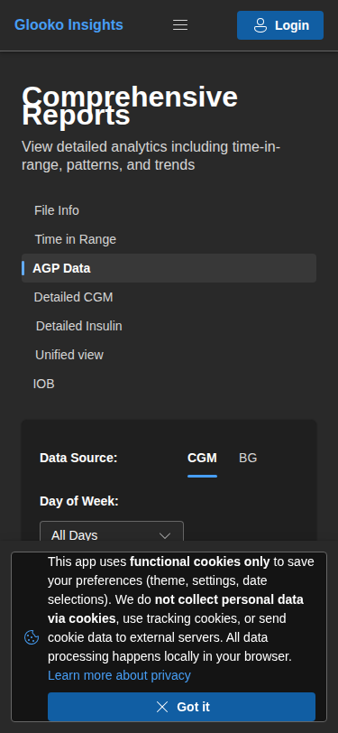
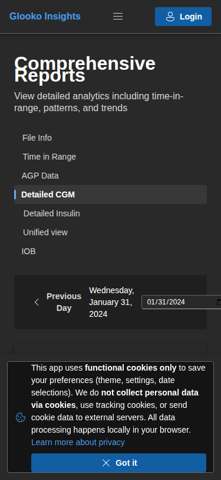
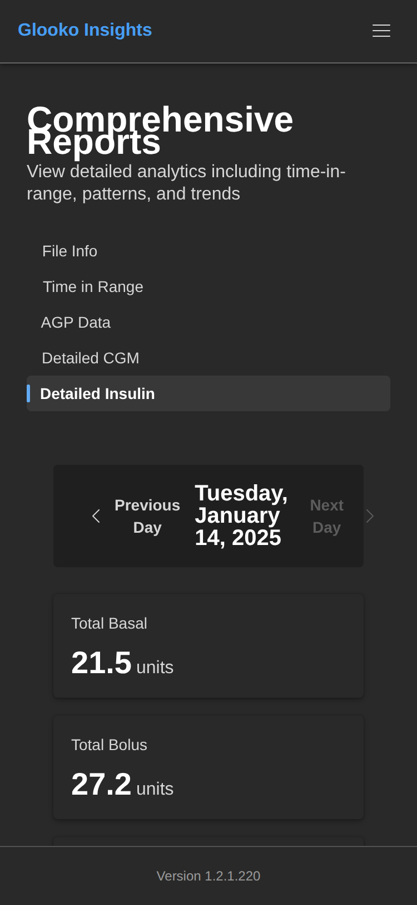
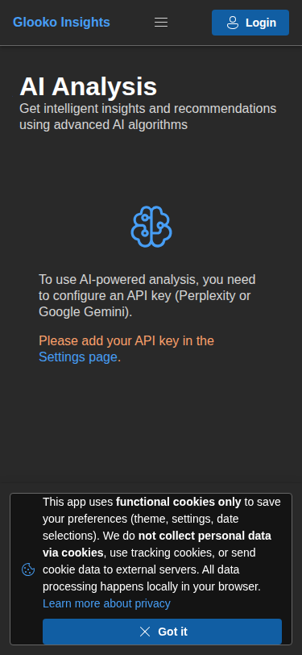
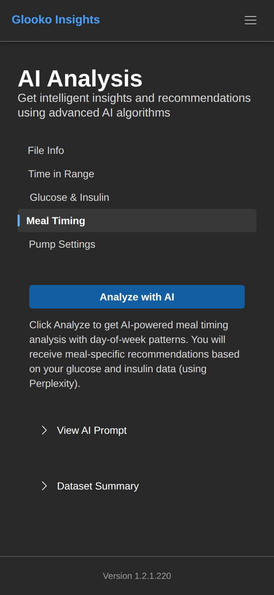
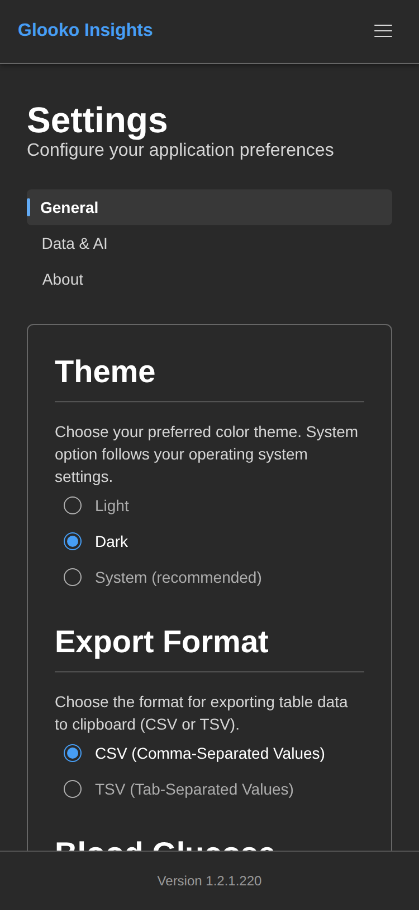
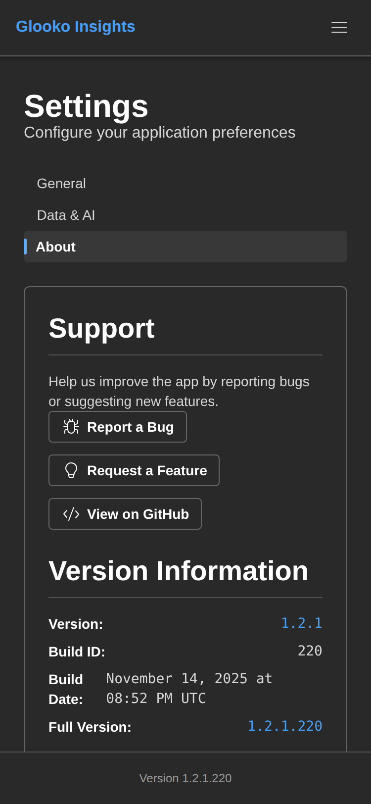

# Mobile Screenshots - Dark Theme

This page showcases the GlookoDataWebApp interface on **mobile devices** (375x812 - iPhone size) with **Dark Theme**.

## Table of Contents

- [Home Page](#home-page)
- [Data Upload](#data-upload)
- [Reports](#reports)
  - [File Info](#reports---file-info)
  - [Time in Range](#reports---time-in-range)
  - [AGP Data](#reports---agp-data)
  - [Detailed CGM](#reports---detailed-cgm)
  - [Detailed Insulin](#reports---detailed-insulin)
- [AI Analysis](#ai-analysis)
  - [File Info](#ai-analysis---file-info)
  - [Time in Range](#ai-analysis---time-in-range)
  - [Glucose & Insulin](#ai-analysis---glucose--insulin)
  - [Meal Timing](#ai-analysis---meal-timing)
  - [Pump Settings](#ai-analysis---pump-settings)
- [Settings](#settings)
  - [General](#settings---general)
  - [Data & AI](#settings---data--ai)
  - [About](#settings---about)

---

## Home Page

The mobile home page features:
- **Compact Layout**: Optimized for small screens
- **Single Column**: Cards stack vertically
- **Touch-Friendly**: Large tap targets (minimum 44x44 pixels)
- **Top Navigation**: Horizontal scrollable menu
- **Four Feature Cards**:
  - Data Upload
  - Comprehensive Reports
  - AI Analysis
  - Settings

**Mobile Optimizations:**
- No horizontal scrolling required
- Responsive font sizes
- Optimized spacing for touchscreens
- Fast loading on mobile networks

---

## Data Upload

The mobile Data Upload page shows:
- **Compact File List**: Stacked layout for uploaded files
- **Expandable Details**: Tap to expand/collapse file information
- **Touch-Friendly Actions**: Large buttons for Delete and Export
- **Drag-and-Drop Alternative**: Tap to browse files on mobile
- **Scrollable Content**: Vertical scrolling for long lists

**Mobile Features:**
- Native file picker integration
- Optimized for cellular data
- Progress indicators for uploads
- Responsive validation badges
- Mobile-friendly accordions

---

## Reports

### Reports - File Info

The mobile File Info tab displays:
- **Vertical Tab Layout**: Tabs arranged for mobile view
- **Scrollable Metadata**: All information accessible by scrolling
- **Compact Cards**: Optimized spacing for mobile
- **Readable Text**: Font sizes adjusted for mobile screens
- **Column Tags**: Wrapped layout for mobile display

### Reports - Time in Range

The mobile Time in Range report features:
- **Responsive Charts**: Charts scale to fit mobile screen
- **Stacked Layout**: Day-of-week bars in vertical list
- **Toggle Control**: Easy to tap 3/5 category switch
- **Scrollable Charts**: Pinch-to-zoom not needed
- **Portrait Optimization**: Charts designed for vertical viewing

**Mobile Chart Features:**
- SVG-based responsive charts
- Touch-friendly legends
- Readable axis labels
- No overflow on small screens
- Optimized color contrast

### Reports - AGP Data

The mobile AGP report shows:
- **Scaled AGP Chart**: Fits perfectly in mobile viewport
- **Vertical Statistics Table**: Stacked rows for readability
- **Scrollable Content**: Easy navigation through data
- **Touch-Friendly Interactions**: Tap to highlight data points
- **Responsive Percentile Lines**: Clear on mobile screens

### Reports - Detailed CGM

The mobile Detailed CGM tab provides:
- **Mobile-Optimized Table**: Horizontal scrolling for wide tables
- **Compact Rows**: Reduced padding for more data visibility
- **Touch-Friendly Pagination**: Large page controls
- **Readable Values**: Appropriate font sizes for glucose readings
- **Timestamp Formatting**: Optimized for mobile display

### Reports - Detailed Insulin

The mobile Detailed Insulin report displays:
- **Compact Table Layout**: Insulin data in mobile-friendly format
- **Scrollable Columns**: Horizontal scroll for all data
- **Summary Statistics**: Visible at top or bottom
- **Touch-Friendly Sorting**: Easy to sort by column
- **Mobile Pagination**: Clear page indicators

---

## AI Analysis

### AI Analysis - File Info

The mobile File Info tab in AI Analysis:
- **Vertical Tabs**: Tabs optimized for mobile navigation
- **Scrollable Metadata**: All file information accessible
- **Compact Cards**: Efficient use of screen space
- **Touch-Friendly**: Easy to tap and scroll

### AI Analysis - Time in Range

The mobile Time in Range AI analysis features:
- **Large Analyze Button**: Easy to tap on mobile
- **Mobile-Friendly Accordions**: Tap to expand prompt/dataset
- **Scrollable Results**: AI responses scroll smoothly
- **Loading Indicators**: Clear feedback during analysis
- **Message Bars**: Full-width notifications on mobile

**Mobile AI Features:**
- Optimized API calls for mobile networks
- Loading states with progress indicators
- Responsive markdown rendering
- Touch-friendly expand/collapse
- Mobile-optimized code blocks

### AI Analysis - Glucose & Insulin

The mobile Glucose & Insulin analysis:
- **Compact Dataset Preview**: Scrollable table in accordion
- **Mobile Prompt View**: Formatted for small screens
- **Responsive AI Results**: Markdown content adapts to mobile
- **Touch-Friendly Buttons**: Large analyze button
- **Scrollable Content**: Vertical scroll for long analyses

### AI Analysis - Meal Timing

The mobile Meal Timing analysis:
- **Mobile Table View**: Meal data in scrollable format
- **Compact Accordions**: Dataset and prompt views
- **Responsive Layout**: All content fits mobile screen
- **Touch Interactions**: Easy to expand and scroll
- **Mobile-Optimized Results**: AI insights readable on mobile

### AI Analysis - Pump Settings

The mobile Pump Settings analysis:
- **Vertical Settings Cards**: Stacked for mobile view
- **Scrollable Data Tables**: Basal and bolus settings
- **Mobile Accordions**: Easy to access datasets
- **Responsive Charts**: Pump data visualizations
- **Touch-Friendly Controls**: Large buttons and inputs

---

## Settings

### Settings - General

The mobile General settings include:
- **Vertical Tab Layout**: Settings tabs optimized for mobile
- **Full-Width Controls**: Radio buttons and inputs span screen
- **Touch-Friendly Theme Selection**: Large tap targets for themes
- **Mobile Sliders**: Glucose threshold sliders easy to adjust
- **Scrollable Form**: All settings accessible by scrolling

**Mobile Controls:**
- Large radio buttons for theme selection
- Mobile-optimized number inputs
- Slider controls with touch feedback
- Real-time value updates
- Save button always accessible

### Settings - Data & AI

The mobile Data & AI settings provide:
- **Stacked Form Layout**: Vertical arrangement of options
- **Mobile Dropdowns**: Full-width select menus
- **Touch-Friendly Toggles**: Large switch components
- **Mobile Radio Buttons**: Easy to select AI provider
- **Password Fields**: Mobile keyboard optimizations
- **Show/Hide Icons**: Large touch targets for API keys

**Mobile Features:**
- Native mobile keyboards for input types
- Password managers integration
- Touch-optimized form controls
- Clear field labels
- Save buttons with loading states

### Settings - About

The mobile About tab displays:
- **Vertical Information Layout**: Stacked content sections
- **Mobile-Friendly Links**: Large tap targets for links
- **Readable Text**: Optimized font sizes for mobile
- **Version Info**: Clearly visible at top
- **Scrollable Content**: All information accessible
- **Footer Integration**: Version also in mobile footer

---

## Mobile Design Principles

### Responsive Layout
- **Single Column**: Content stacks vertically on mobile
- **No Horizontal Overflow**: Everything fits in viewport width
- **Flexible Components**: All UI elements adapt to screen size
- **Touch-First Design**: Built for touch interactions

### Touch Optimization
- **Minimum Touch Targets**: 44x44 pixels for all interactive elements
- **Adequate Spacing**: Sufficient padding between tap targets
- **Swipe Gestures**: Support for native mobile gestures
- **Tap Feedback**: Visual feedback for all interactions

### Performance
- **Fast Loading**: Optimized assets for mobile networks
- **Efficient Rendering**: Smooth scrolling and transitions
- **Battery Conscious**: Minimized animations and processing
- **Offline Capable**: Works with intermittent connectivity

### Mobile Navigation
- **Horizontal Menu**: Swipeable navigation tabs
- **Back Button**: Browser back button support
- **Sticky Header**: Navigation always accessible
- **Bottom Padding**: Content doesn't hide under keyboards

### Typography
- **Readable Fonts**: Minimum 14px font size for body text
- **Scalable Text**: Respects user font size preferences
- **High Contrast**: Dark theme with optimal contrast ratios
- **Line Height**: Comfortable reading on small screens

### Accessibility
- **Screen Reader Support**: ARIA labels for mobile screen readers
- **High Contrast**: Meets WCAG guidelines on mobile
- **Focus Management**: Logical focus order for keyboard users
- **Touch Gestures**: Alternative to complex interactions

---

## Mobile-Specific Features

### Orientation Support
- **Portrait Mode**: Primary design for vertical viewing
- **Landscape Mode**: Adapts for horizontal viewing
- **Rotation Handling**: Smooth transitions between orientations
- **Layout Reflow**: Content reorganizes appropriately

### Network Awareness
- **Optimized Requests**: Minimal data transfer
- **Offline Mode**: View cached data without connection
- **Background Sync**: Updates when connection restored
- **Loading States**: Clear feedback during network operations

### Mobile Browser Support
- **Safari iOS**: Full support for iPhone and iPad
- **Chrome Android**: Optimized for Android devices
- **Mobile Browser Features**: Uses mobile-specific APIs
- **Progressive Web App**: Can be added to home screen

---

## Related Documentation

- [All Screenshots (Single Page)](ALL_SCREENSHOTS.md)
- [Light Mode Screenshots](SCREENSHOTS_LIGHT.md)
- [Dark Mode Screenshots](SCREENSHOTS_DARK.md)
- [Main Screenshots Overview](../SCREENSHOTS.md)
- [Data Upload Guide](../DATA_UPLOAD.md)
- [Reports Documentation](../REPORTS.md)
- [Settings Guide](../SETTINGS.md)
- [Main README](../../README.md)
