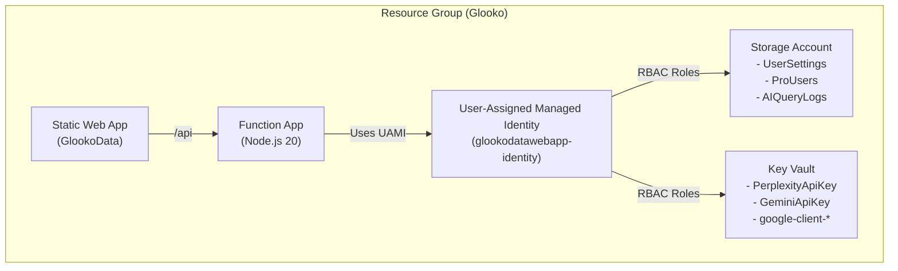

# GlookoDataWebApp Infrastructure as Code (Bicep)

This directory contains Bicep templates for deploying the complete Azure infrastructure for GlookoDataWebApp.

## Overview

The infrastructure consists of:

1. **User-Assigned Managed Identity** - For passwordless authentication
2. **Storage Account** - With Table Storage for user data (UserSettings, ProUsers, AIQueryLogs)
3. **Key Vault** - For secure secrets management (API keys, OAuth credentials)
4. **Function App** - Node.js 20 backend API (consumption plan)
5. **Static Web App** - React frontend with global CDN
6. **RBAC Role Assignments** - Managed Identity permissions for Storage and Key Vault
7. **Resource Locks** - CanNotDelete protection on Storage Account, Key Vault, and Managed Identity

## Architecture



## Files

- **main.bicep** - Main orchestration template
- **Bicep modules** - Modular resource definitions in infra root (prefixed with `module_`):
  - `module_managed-identity.bicep` - User-Assigned Managed Identity
  - `module_storage.bicep` - Storage Account with Tables and CORS
  - `module_key-vault.bicep` - Key Vault with RBAC
  - `module_function-app.bicep` - Azure Function App with flexible hosting plan support
  - `module_static-web-app.bicep` - Azure Static Web App
- **parameters.generic.bicepparam** - Generic parameter file with standard names
- **parameters.current.bicepparam** - Current production deployment parameters
- **validate.sh** - Quick validation script (validates syntax and checks parameters)
- **verify.sh** - Automated verification script (runs what-if analysis)

### Documentation

Documentation files are located in the `docs/` subdirectory:

- **docs/USER_GUIDE.md** - **START HERE** - Quick start guide for deployment
- **docs/RESOURCE_LOCKS.md** - **NEW** - Resource locks for data protection and lock management guide
- **docs/MINIMAL_CHANGES_SUMMARY.md** - **NEW** - Explains removed best practices and minimal changes approach
- **docs/FIX_SUMMARY.md** - Overview of what-if fixes and solutions
- **docs/WHAT_IF_ANALYSIS.md** - Detailed analysis of all what-if changes
- **docs/WHAT_IF_DELTAS_EXPLAINED.md** - Comprehensive explanation of what-if deltas (roleAssignments, Key Vault, Function App, etc.)
- **docs/EXPECTED_WHAT_IF.md** - Expected output, red flags, and troubleshooting
- **docs/MANUAL_VERIFICATION.md** - Step-by-step manual verification
- **docs/QUICK_REFERENCE.md** - Quick command reference

## Prerequisites

- Azure CLI installed (version 2.50.0 or later)
- Bicep CLI (included with Azure CLI)
- Logged in to Azure: `az login`
- Contributor or Owner role on the target subscription
- Existing resource group (or permission to create one)

## Parameter Files

### Generic Parameters

Use `parameters.generic.bicepparam` for new deployments with standard naming:

```bicep
param location = 'westeurope'
param storageAccountName = 'glookodatawebappstorage'
param managedIdentityName = 'glooko-identity'
param keyVaultName = 'glooko-kv'
param functionAppName = 'glooko-func'
param staticWebAppName = 'glooko-swa'
param staticWebAppSku = 'Standard'
param webAppUrl = 'https://glooko.example.com'
```

### Current Production Parameters

Use `parameters.current.bicepparam` to match existing production infrastructure:

```bicep
param location = 'westeurope'
param storageAccountName = 'glookodatawebappstorage'
param managedIdentityName = 'glookodatawebapp-identity'
param keyVaultName = 'glookodatawebapp-kv'
param functionAppName = 'glookodatawebapp-func'
param staticWebAppName = 'GlookoData'
param staticWebAppSku = 'Standard'
param webAppUrl = 'https://glooko.iric.online'
```

## Deployment

### Step 1: Validate Bicep Syntax

**Option 1: Using the quick validation script (recommended):**

```bash
cd infra
./validate.sh
```

This script will:
- ✅ Validate all Bicep templates
- ✅ Validate parameter files
- ✅ Check critical parameters (CORS, hosting plan, App Insights)
- ✅ Provide next steps

**Option 2: Manual validation:**

```bash
# Validate the Bicep template
az bicep build --file main.bicep

# Validate parameter files
az bicep build-params --file parameters.current.bicepparam
```

### Step 2: Create Resource Group (if needed)

```bash
# Create resource group for current deployment
az group create --name Glooko --location westeurope

# OR for generic deployment
az group create --name glooko-rg --location westeurope
```

### Step 3: Run What-If Analysis (Manual Verification)

**Option 1: Using the automated verification script (recommended):**

```bash
cd infra

# Verify current production infrastructure
./verify.sh

# OR verify generic deployment
./verify.sh --generic

# With verbose output
./verify.sh --verbose
```

The script will:
- ✅ Validate Bicep syntax
- ✅ Check Azure login status
- ✅ Run what-if analysis
- ✅ Analyze results and provide recommendations

**Option 2: Manual what-if (if you prefer):**

**For current production infrastructure:**

```bash
cd infra

# Run what-if to preview changes
az deployment group what-if \
  --resource-group Glooko \
  --template-file main.bicep \
  --parameters parameters.current.bicepparam
```

**After running what-if:**
- ✅ Review [EXPECTED_WHAT_IF.md](./EXPECTED_WHAT_IF.md) to understand what changes are expected
- ✅ Check for any red flags listed in the documentation
- ✅ Verify CORS is preserved, existing hosting plan is used, etc.
- ✅ See [WHAT_IF_ANALYSIS.md](./WHAT_IF_ANALYSIS.md) for detailed explanation of all changes

**For generic deployment:**

```bash
cd infra

# Run what-if to preview changes
az deployment group what-if \
  --resource-group glooko-rg \
  --template-file main.bicep \
  --parameters parameters.generic.bicepparam
```

**Success Criteria:**

The what-if should show:
- ✅ **"No Change"** for all existing resources (if matching current infra)
- ✅ **"Ignore"** for minor non-functional differences (like object ordering)
- ❌ **Avoid "Create"** or "Delete"** operations on existing resources

### Step 4: Deploy (After What-If Verification)

**Only after what-if shows no unexpected changes:**

```bash
# Deploy to current production
az deployment group create \
  --resource-group Glooko \
  --template-file main.bicep \
  --parameters parameters.current.bicepparam \
  --confirm-with-what-if

# OR deploy generic infrastructure
az deployment group create \
  --resource-group glooko-rg \
  --template-file main.bicep \
  --parameters parameters.generic.bicepparam \
  --confirm-with-what-if
```

The `--confirm-with-what-if` flag shows a final what-if preview before deployment and prompts for confirmation.

## Post-Deployment Steps

After deploying the infrastructure, you need to:

### 1. Add Secrets to Key Vault

```bash
# Perplexity API Key
az keyvault secret set \
  --vault-name glookodatawebapp-kv \
  --name "PerplexityApiKey" \
  --value "<your-perplexity-api-key>"

# Google Gemini API Key
az keyvault secret set \
  --vault-name glookodatawebapp-kv \
  --name "GeminiApiKey" \
  --value "<your-gemini-api-key>"

# Google OAuth Client ID
az keyvault secret set \
  --vault-name glookodatawebapp-kv \
  --name "google-client-id" \
  --value "<your-google-client-id>"

# Google OAuth Client Secret
az keyvault secret set \
  --vault-name glookodatawebapp-kv \
  --name "google-client-secret" \
  --value "<your-google-client-secret>"
```

### 2. Link Function App Backend to Static Web App

The Static Web App needs to be linked to the Function App for `/api/*` routes to work.

**Using Azure CLI:**

```bash
# Get your subscription ID
SUBSCRIPTION_ID=$(az account show --query id -o tsv)

# Link the backend
az staticwebapp backends link \
  --name GlookoData \
  --resource-group Glooko \
  --backend-resource-id "/subscriptions/${SUBSCRIPTION_ID}/resourceGroups/Glooko/providers/Microsoft.Web/sites/glookodatawebapp-func" \
  --backend-region westeurope

# Verify the link
az staticwebapp backends list \
  --name GlookoData \
  --resource-group Glooko
```

**Using deployment scripts:**

```bash
# Using Bash script
cd ../scripts/deployment-cli
./deploy-azure-swa-backend.sh

# OR using PowerShell module
Import-Module GlookoDeployment
Set-GlookoSwaBackend
```

### 3. Deploy Application Code

Deploy the frontend and backend code using:

1. **GitHub Actions workflow** (recommended)
2. **Manual deployment** via `az functionapp deployment` and SWA CLI
3. **Deployment scripts** in `scripts/deployment-cli/` or `scripts/deployment-ps/`

See [DEPLOYMENT.md](../docs/DEPLOYMENT.md) for detailed instructions.

## Verification

Verify the deployment:

```bash
# Check all resources in the resource group
az resource list --resource-group Glooko --output table

# Verify managed identity
az identity show \
  --name glookodatawebapp-identity \
  --resource-group Glooko

# Verify storage tables
az storage table list \
  --account-name glookodatawebappstorage \
  --auth-mode login

# Verify key vault
az keyvault show \
  --name glookodatawebapp-kv

# Verify function app settings
az functionapp config appsettings list \
  --name glookodatawebapp-func \
  --resource-group Glooko

# Verify static web app
az staticwebapp show \
  --name GlookoData \
  --resource-group Glooko
```

## RBAC Roles

The Bicep template automatically assigns these RBAC roles:

1. **Key Vault Secrets User** - Managed Identity → Key Vault
   - Allows Function App to read secrets
   
2. **Storage Table Data Contributor** - Managed Identity → Storage Account
   - Allows Function App to read/write table data
   
3. **Storage Blob Data Contributor** - Managed Identity → Storage Account
   - Allows Function App to access blob storage (for function app storage)

## Customization

### Changing Resource Names

Edit the parameter file:

```bicep
// parameters.custom.bicepparam
using './main.bicep'

param location = 'eastus'  // Change location
param storageAccountName = 'myglookostorage'  // Change names
param functionAppName = 'my-glooko-func'
// ... other parameters
```

### Changing SKUs

```bicep
param storageSku = 'Standard_GRS'  // Geo-redundant storage
param staticWebAppSku = 'Free'     // Free tier for testing
```

### Adding More Tables

```bicep
param tableNames = [
  'UserSettings'
  'ProUsers'
  'AIQueryLogs'
  'CustomTable1'  // Add custom tables
  'CustomTable2'
]
```

## Troubleshooting

### What-If Shows Unexpected Changes

1. **Resource already exists** - Ensure resource names match exactly
2. **Different configuration** - Check all properties in parameter file
3. **RBAC differences** - Role assignments use GUIDs and may show as "Ignore"
4. **Tags** - Tags are not set by default to reduce noise in what-if output. Resources maintain their existing tags.

### Deployment Fails

1. **Name conflicts** - Resource names must be globally unique (Storage, Key Vault, Static Web App)
2. **Permission denied** - Ensure you have Contributor role on the subscription
3. **Quota exceeded** - Check Azure subscription quotas
4. **Region unavailable** - Try a different region

### Static Web App Backend Not Working

The backend link is **not** created by Bicep due to API limitations. You must link it manually:

```bash
az staticwebapp backends link \
  --name GlookoData \
  --resource-group Glooko \
  --backend-resource-id "/subscriptions/${SUBSCRIPTION_ID}/resourceGroups/Glooko/providers/Microsoft.Web/sites/glookodatawebapp-func" \
  --backend-region westeurope
```

## CI/CD Integration

### Infrastructure Check Workflow (The Watchman) 🔍

**Status:** ✅ **IMPLEMENTED**

The repository now includes an automated infrastructure validation workflow that runs on every Pull Request:

- **Workflow File:** `.github/workflows/infra-check.yml`
- **Purpose:** Validates Bicep changes using Azure what-if analysis (read-only)
- **Triggers:** Automatically runs when PR modifies files in `infra/`
- **Authentication:** Uses OIDC (OpenID Connect) for keyless Azure authentication
- **Output:** Posts what-if results as PR comment

**Setup Instructions:** See [`.github/workflows/INFRA_CHECK_SETUP.md`](../.github/workflows/INFRA_CHECK_SETUP.md)

**Required GitHub Secrets:**
- `AZURE_DEPLOYER_CLIENT_ID` - Application (Client) ID
- `AZURE_TENANT_ID` - Azure AD Tenant ID
- `AZURE_SUBSCRIPTION_ID` - Azure Subscription ID

**What it does:**
1. ✅ Validates Bicep syntax
2. ✅ Runs `az deployment group what-if` analysis
3. ✅ Detects destructive changes (deletions, modifications)
4. ✅ Posts formatted results as PR comment
5. ✅ Read-only - never deploys resources

### Future: Deployment Workflow (Write Access)

After testing the read-only workflow, you can create `.github/workflows/deploy-infrastructure.yml` for automated deployments:

```yaml
name: Deploy Infrastructure

on:
  workflow_dispatch:
  push:
    paths:
      - 'infra/**'
    branches:
      - main

jobs:
  deploy:
    runs-on: ubuntu-latest
    steps:
      - uses: actions/checkout@v4
      
      - name: Azure Login
        uses: azure/login@v2
        with:
          client-id: ${{ secrets.AZURE_DEPLOYER_CLIENT_ID }}
          tenant-id: ${{ secrets.AZURE_TENANT_ID }}
          subscription-id: ${{ secrets.AZURE_SUBSCRIPTION_ID }}
      
      - name: Deploy Bicep
        run: |
          az deployment group create \
            --resource-group Glooko \
            --template-file infra/main.bicep \
            --parameters infra/parameters.current.bicepparam \
            --confirm-with-what-if
```

### OIDC Setup for GitHub Actions

Modern approach using OpenID Connect (recommended):

```bash
# Create Azure AD application
APP_NAME="GlookoDataWebApp-GitHub-Actions"
az ad app create --display-name "$APP_NAME"

APP_ID=$(az ad app list --display-name "$APP_NAME" --query "[0].appId" -o tsv)
TENANT_ID=$(az account show --query tenantId -o tsv)

# Create service principal
az ad sp create --id $APP_ID

# Assign Contributor role
az role assignment create \
  --role "Contributor" \
  --assignee $APP_ID \
  --scope "/subscriptions/${SUBSCRIPTION_ID}/resourceGroups/Glooko"

# Configure federated credentials for GitHub
az ad app federated-credential create \
  --id $APP_ID \
  --parameters '{
    "name": "GitHubActionsPR",
    "issuer": "https://token.actions.githubusercontent.com",
    "subject": "repo:iricigor/GlookoDataWebApp:pull_request",
    "audiences": ["api://AzureADTokenExchange"]
  }'
```

**Benefits of OIDC:**
- ✅ No long-lived secrets to manage
- ✅ Automatic credential rotation
- ✅ More secure than service principal keys
- ✅ Granular permissions per workflow

See [INFRA_CHECK_SETUP.md](../.github/workflows/INFRA_CHECK_SETUP.md) for detailed setup instructions.

## Best Practices

1. ✅ **Always run what-if** before deploying to production
2. ✅ **Use parameter files** for different environments
3. ✅ **Version control** all Bicep files
4. ✅ **Test in dev** environment before production
5. ✅ **Use managed identity** for passwordless authentication
6. ✅ **Store secrets in Key Vault**, never in code or parameters
7. ✅ **Enable soft delete** for Key Vault (already enabled in template)
8. ✅ **Use RBAC** instead of access policies (already configured)

## Resources

- **[User Guide](./docs/USER_GUIDE.md)** - 🌟 **START HERE** - Quick start and complete deployment workflow
- **[Resource Locks Guide](./docs/RESOURCE_LOCKS.md)** - 🔒 Resource locks for data protection and lock management
- [Fix Summary](./docs/FIX_SUMMARY.md) - Overview of what-if fixes implemented
- [What-If Analysis](./docs/WHAT_IF_ANALYSIS.md) - Detailed analysis of first what-if run and resolutions
- [Expected What-If Results](./docs/EXPECTED_WHAT_IF.md) - What to expect and red flags to watch for
- [Manual Verification Guide](./docs/MANUAL_VERIFICATION.md) - Step-by-step manual verification
- [Quick Reference](./docs/QUICK_REFERENCE.md) - Quick command reference
- [Azure Bicep Documentation](https://learn.microsoft.com/azure/azure-resource-manager/bicep/)
- [Bicep Best Practices](https://learn.microsoft.com/azure/azure-resource-manager/bicep/best-practices)
- [Azure Static Web Apps](https://learn.microsoft.com/azure/static-web-apps/)
- [Azure Functions](https://learn.microsoft.com/azure/azure-functions/)
- [Managed Identity](https://learn.microsoft.com/azure/active-directory/managed-identities-azure-resources/)
- [GlookoDataWebApp Deployment Guide](../docs/DEPLOYMENT.md)

## Support

For issues or questions:

- Open an issue on [GitHub](https://github.com/iricigor/GlookoDataWebApp/issues)
- Review existing deployment scripts in `scripts/deployment-cli/` and `scripts/deployment-ps/`
- Check the main [DEPLOYMENT.md](../docs/DEPLOYMENT.md) guide
